# CGInstance 实例任务批处理系统技术方案

状态：草稿
创建日期：2026-05-15
建议归档位置：`01_Projects/CGInstance 实例任务批处理系统/`

## 背景：

CGInstance 是面向云游戏实例生命周期操作的实例任务批处理系统，核心关键词是海量任务、多阶段、大吞吐、可恢复、可观测。

它需要承载的典型任务包括：

```text
实例重启
实例启动 / 关机
实例状态检查
系统镜像制作
系统镜像分发
批量实例操作
```

这些任务通常不是一次 RPC 调用可以完成，而是包含多个阶段、多个下游系统、较长执行时间和较多失败场景。因此 CGInstance 不应被设计成简单任务队列，而应被设计成面向实例生命周期操作的分片状态机调度系统。

## 问题：

CGInstance 要解决的核心矛盾是：在海量实例任务场景下，既要提高吞吐，又要保证任务状态可靠、失败可恢复、过程可观测，并避免同一实例上的互斥操作发生并发冲突。

主要问题包括：

- 海量任务下，单点调度或全量扫描容易造成数据库压力和调度竞争。
- 多阶段任务如果只记录最终成功/失败，无法定位失败阶段，也无法从中间恢复。
- Worker、MQ、Scheduler 任意一环异常，都可能导致任务卡住、重复执行或状态不一致。
- 同一实例可能同时收到重启、关机、制作镜像等互斥操作，需要实例级串行化。
- 下游 IaaS 系统存在承载上限，需要多维度限流。IaaS 系统封装阿里云、腾讯云、自建机房等资源侧差异，对 CGInstance 提供标准化实例操作接口。
- 批量任务需要面向用户展示整体进度、失败明细、慢任务和重试状态。

## 方案：

将 CGInstance 定位为：

> CGInstance 是一个面向实例生命周期操作的高吞吐、可恢复、可观测的分片状态机调度系统。

核心设计：

- DB 作为任务状态源，保存任务、阶段、状态、重试、租约、失败原因和 Timeline。
- MQ 只负责异步派发，不作为最终状态源。
- Scheduler 负责扫描可执行阶段、推进状态、派发消息和异常接管。
- Worker 负责执行具体阶段，并将执行结果写回 DB。
- 按 `instance_id` 分片，保证同一实例任务天然落到同一调度分片。
- 阶段级状态机支持重试、取消、超时、租约恢复和幂等执行。
- 通过全局、租户、任务类型、Region/AZ、下游系统等维度做限流。
- 通过 Timeline、指标、错误归因和审计记录支撑排障。

## 总体架构

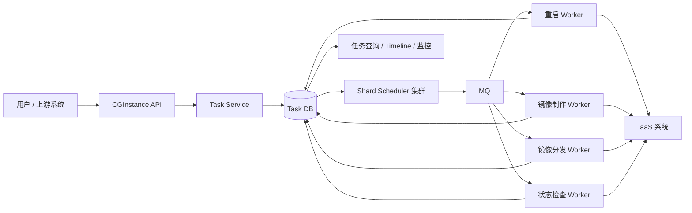

模块职责：

| 模块              | 职责                           |
| --------------- | ---------------------------- |
| CGInstance API  | 接收任务创建、查询、取消、暂停、恢复请求         |
| Task Service    | 生成任务与阶段，校验参数，写入任务状态          |
| Task DB         | 任务状态源，保存任务、阶段、租约、重试、Timeline |
| Shard Scheduler | 分片扫描可执行阶段，派发 MQ，处理超时和异常恢复    |
| MQ              | 异步派发阶段执行消息，提高吞吐并解耦调度和执行      |
| Worker          | 执行阶段动作，调用 IaaS 标准化接口，写回阶段结果  |
| Timeline / 监控   | 展示阶段进度、耗时、失败原因、重试和审计信息       |

IaaS 系统是 CGInstance 的下游基础设施接口层，负责屏蔽阿里云、腾讯云、自建机房等资源侧差异，向 CGInstance 提供统一的实例重启、启动、关机、制作系统镜像等能力。

## 任务模型

建议把任务拆成两层：

- `Task`：用户视角的一次完整任务，例如批量重启、制作系统镜像、分发镜像。
- `TaskStage`：系统内部可调度、可重试、可取消、可观测的最小执行阶段。

示例：制作系统镜像任务可以拆成：

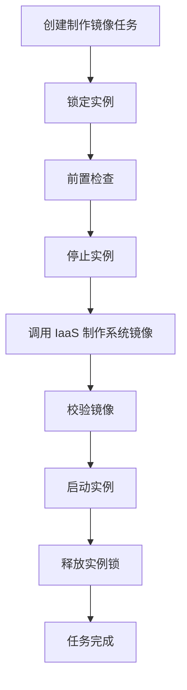

阶段化的价值：

- 失败可以定位到具体阶段。
- 重试只重试失败阶段，不必重跑整个任务。
- 查询可以看到完整过程。
- Worker 异常后可以从阶段状态恢复。
- 不同任务类型可以复用阶段能力。

## 任务状态机

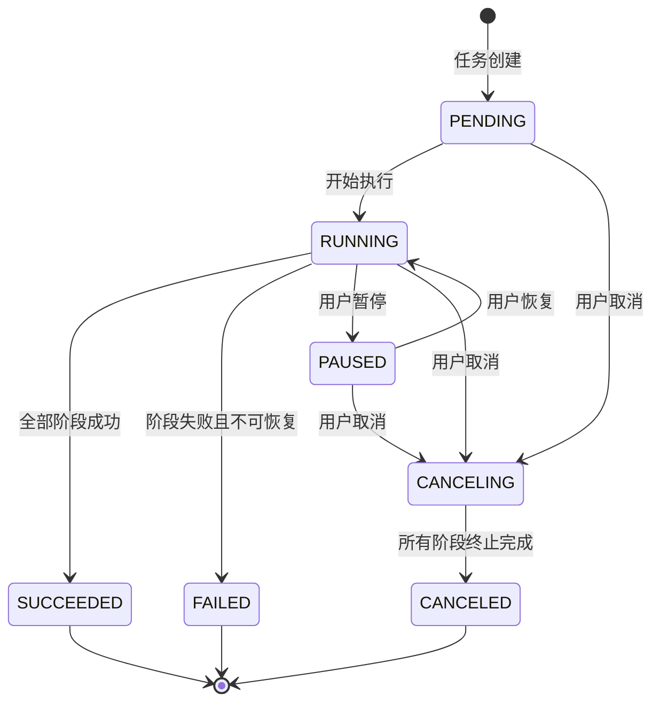

任务状态说明：

| 状态 | 说明 |
|---|---|
| PENDING | 任务已创建，等待调度 |
| RUNNING | 任务正在执行 |
| PAUSED | 任务暂停，不再调度新阶段 |
| CANCELING | 任务正在取消 |
| CANCELED | 任务已取消 |
| SUCCEEDED | 任务成功 |
| FAILED | 任务失败 |

## 阶段状态机

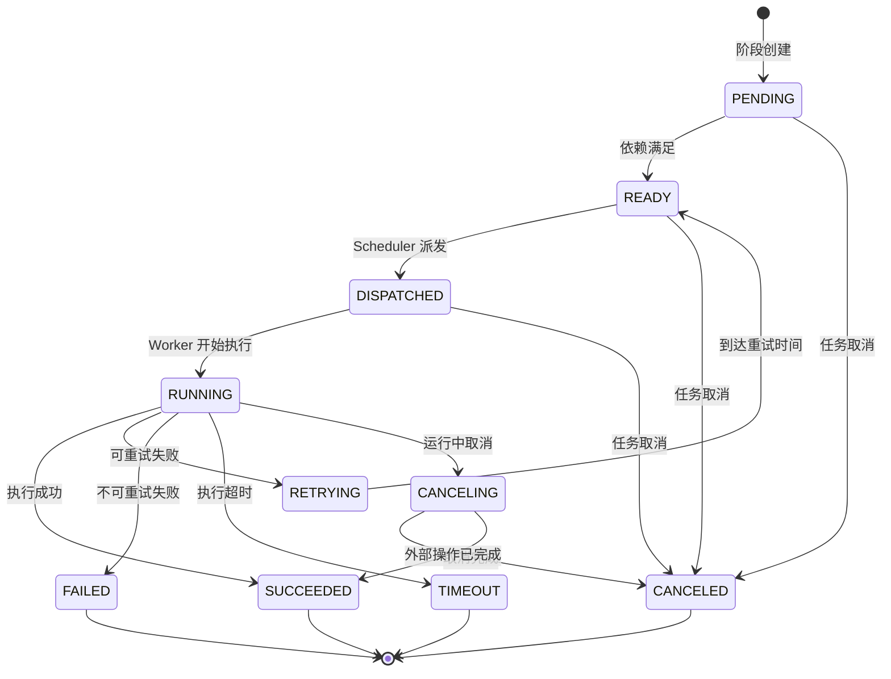

阶段不是只有成功和失败，还需要表达等待执行、已派发、执行中、重试中、取消中、已取消、超时等状态。这套状态机是系统可靠性的核心。

## 正常执行流程

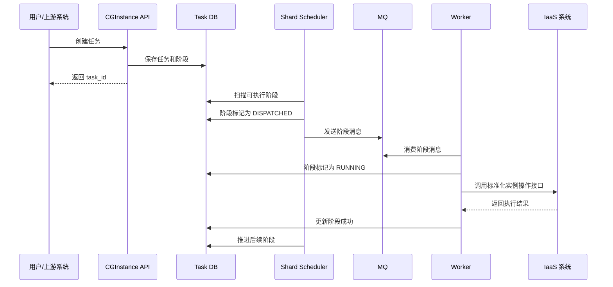

核心特点：

- 用户提交任务后立即返回，不同步等待长耗时操作。
- Scheduler 异步推进任务阶段。
- Worker 异步执行阶段动作。
- 所有状态都以 DB 为准。

## 失败重试流程

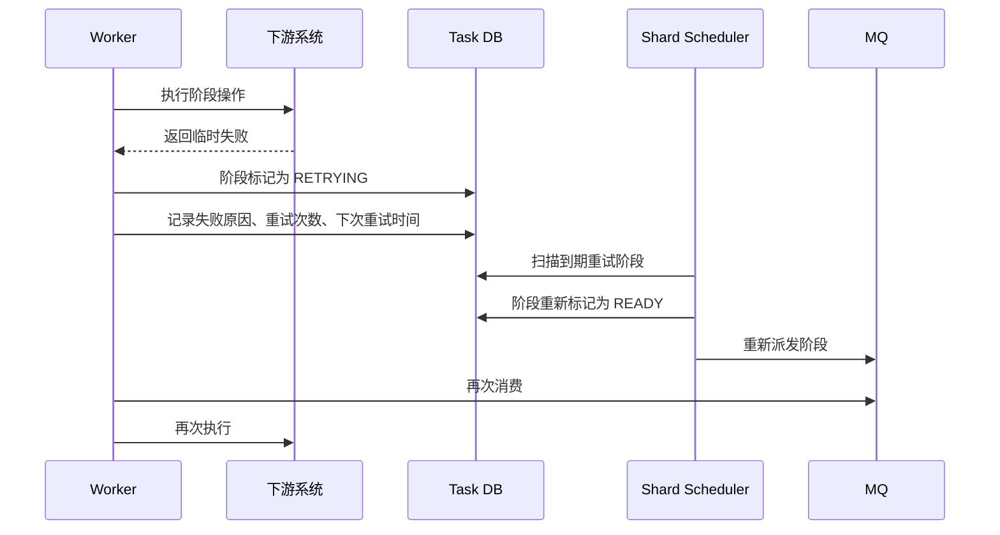

重试原则：

- 不是所有失败都重试。
- 只对临时错误、下游超时、资源暂不可用等可恢复错误重试。
- 重试必须有最大次数和退避策略。
- 取消优先级高于重试。
- 阶段执行必须尽量幂等，避免重复副作用。

## 取消流程

取消正在执行的阶段时，不建议直接杀掉 Worker，应采用协作式取消。

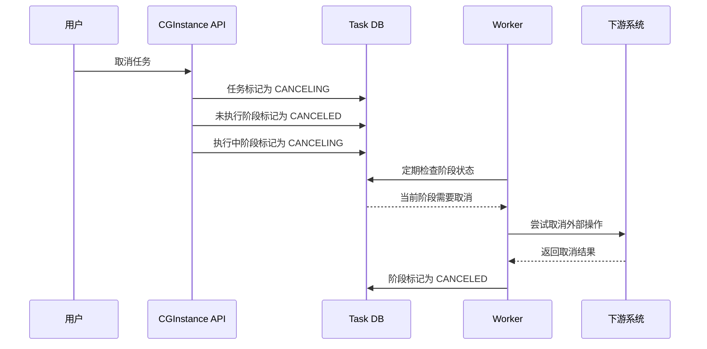

取消原则：

- 未执行阶段可以直接取消。
- 运行中阶段进入取消中。
- Worker 协作停止，不直接依赖强杀进程。
- 有些阶段不能强行取消。
- 清理类阶段必须继续执行，例如释放实例锁。

阶段取消适配：

| 阶段 | 是否适合取消 |
|---|---|
| 前置检查 | 可以取消 |
| 镜像制作 | 视下游能力决定 |
| 镜像分发 | 部分可取消 |
| 释放实例锁 | 不建议取消，必须执行 |

## 异常恢复

### Worker 异常恢复

Worker 执行阶段时需要写入租约并定期续约。Scheduler 扫描到执行中但租约过期的阶段后，负责接管恢复。

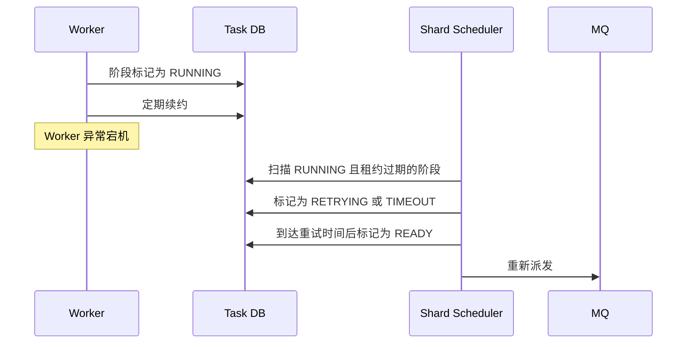

恢复原则：

- Worker 挂了不代表任务丢了。
- DB 中仍然保留任务和阶段状态。
- Scheduler 会重新接管。
- 阶段必须支持幂等或具备外部结果确认能力。

### MQ 消息丢失恢复

MQ 只做派发，不做最终状态源。即使消息异常丢失，也应通过 DB 状态扫描恢复。

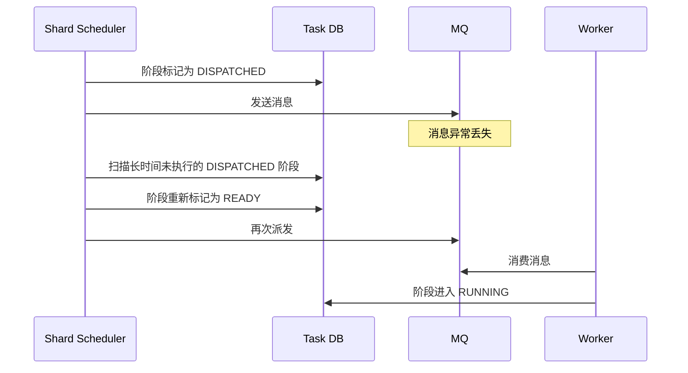

核心原则：MQ 丢消息不会导致任务丢失，因为任务状态在 DB 中。

## 分片调度

如果所有 Scheduler 都扫描全部任务，会导致数据库压力大、重复竞争和调度冲突。CGInstance 应采用分片调度器。

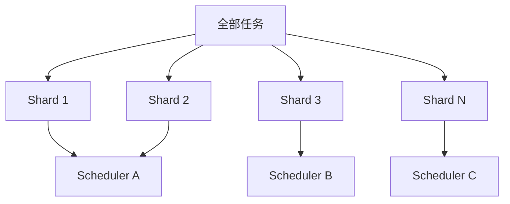

分片价值：

- 避免所有调度器扫描全部任务。
- 降低数据库压力。
- 提高调度吞吐。
- 减少任务竞争。
- 支持横向扩容。
- 支持故障接管。

## 为什么按 instance_id 分片

CGInstance 的核心对象是实例。同一个实例不能同时执行多个互斥操作，例如同一实例同时重启、制作镜像、关机会造成冲突。

建议分片规则：

```text
shard_id = hash(instance_id) % shard_count
```

这样可以保证：

- 同一个 `instance_id` 永远落到同一个 shard。
- 同一实例任务天然串行。
- 不同实例任务可以并行执行。

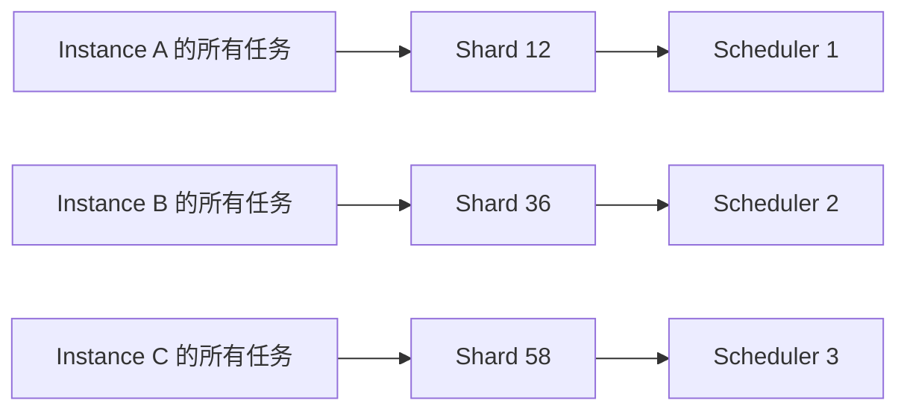

## 实例互斥

实例互斥的目标是：同一个实例，同一时间只能执行一个互斥任务。

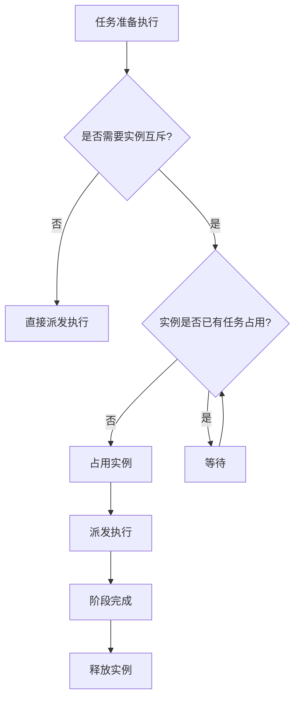

适用场景：

- 重启实例。
- 关机实例。
- 启动实例。
- 制作系统镜像。
- 修改实例配置。

需要注意：实例互斥不能只依赖分片。分片解决“同一实例落到同一调度范围”，互斥锁解决“同一时间只允许一个互斥阶段占用实例”。两者应同时存在。

## 限流设计

CGInstance 需要保护自身和下游系统，不能无限制并发。

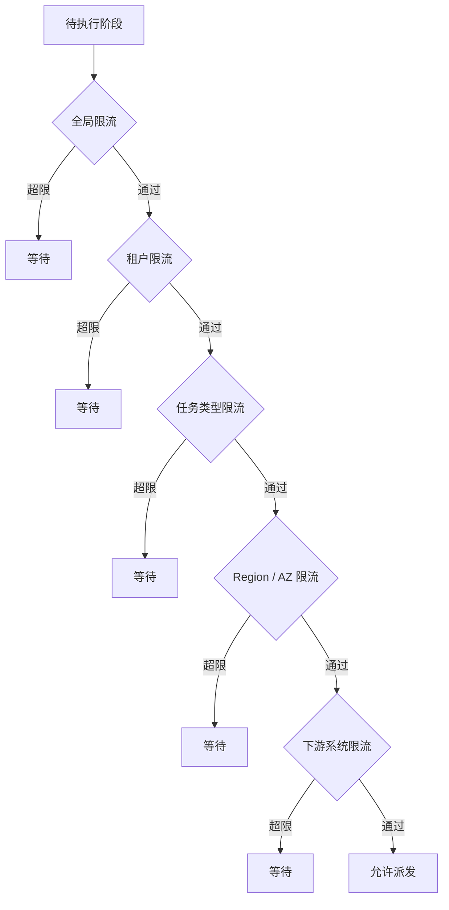

常见限流维度：

| 维度 | 目的 |
|---|---|
| 全局限流 | 保护 CGInstance 自身 |
| 租户限流 | 避免单个租户打满系统 |
| 任务类型限流 | 避免镜像制作等重任务过载 |
| Region / AZ 限流 | 保护区域资源 |
| 下游系统限流 | 保护 IaaS 系统及其背后的阿里云、腾讯云、自建机房资源 |

## 可观测性

每个任务都应有一条完整 Timeline。


用户和运维人员需要看到：

- 任务当前执行到哪一步。
- 哪一步耗时最长。
- 哪一步失败了。
- 失败原因是什么。
- 是否正在重试。
- 是否已经取消。
- 是否需要人工处理。

失败展示不应只显示 `FAILED` 或 `UNKNOWN_ERROR`，而应包含：

- 失败阶段。
- 失败原因。
- 是否可重试。
- 已重试次数 / 最大重试次数。
- 下次重试时间。
- 建议处理动作。

批量任务视图应包含：

- 总数。
- 成功数。
- 失败数。
- 执行中数量。
- 等待数量。
- 重试数量。
- 失败明细。
- 慢任务明细。

## 系统可靠性总览

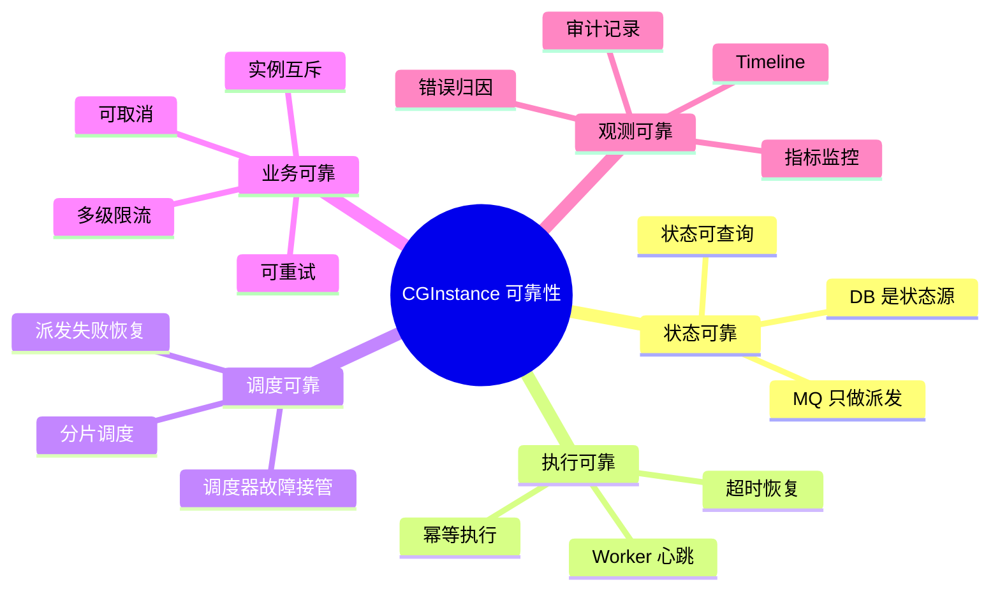

## MVP 范围

第一版建议聚焦“可靠跑起来”，避免一开始做复杂平台化能力。

MVP 应包含：

- 任务创建。
- 任务查询。
- 阶段状态机。
- 分片调度。
- MQ 派发。
- Worker 执行。
- 失败重试。
- 任务取消。
- 超时恢复。
- 实例互斥。
- 任务 Timeline。

MVP 暂缓：

- 复杂可视化 DAG 编辑器。
- 复杂补偿流程。
- 动态热分片拆分。
- 跨任务依赖。
- 高级公平调度。
- 多集群调度。

## 演进路线

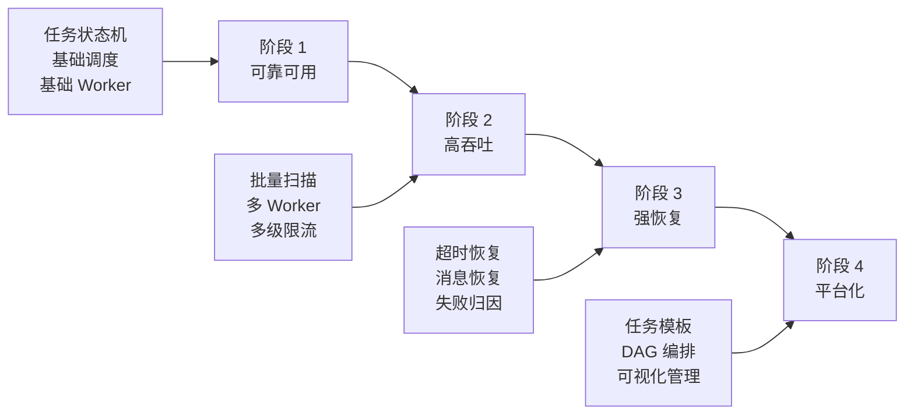

| 阶段 | 目标 |
|---|---|
| 阶段 1：可靠可用 | 任务可以稳定执行，失败可查询 |
| 阶段 2：高吞吐 | 支持大批量任务并发 |
| 阶段 3：强恢复 | Worker、MQ、Scheduler 异常后可恢复 |
| 阶段 4：平台化 | 支持更多任务类型和可视化编排 |

## 为什么这么做：

这套方案的关键取舍是：用 DB 状态机保证可靠性，用 MQ 提升吞吐和解耦，用分片调度降低扫描压力，用实例互斥解决业务冲突，用 Timeline 解决排障和用户感知。

替代方案对比：

| 方案 | 优点 | 问题 |
|---|---|---|
| 纯 MQ 任务队列 | 简单，吞吐高 | 状态不可靠，失败恢复和查询弱，难支撑多阶段流程 |
| 单 Scheduler 全量扫描 | 实现简单 | 数据库压力大，扩展性差，容易竞争同一批任务 |
| 直接同步 RPC | 链路直观 | 不适合长耗时和批量任务，超时、重试、取消困难 |
| 引入完整工作流引擎 | 编排能力强 | 接入和迁移成本高，需确认是否适配实例级互斥和高吞吐扫描 |
| 分片状态机调度 | 可靠、可扩展、贴合实例任务 | 实现复杂度较高，需要状态机、租约、幂等、限流配合 |

## 踩坑：

- 只记录任务最终状态会导致失败不可定位，后续无法重试单个阶段。
- 把 MQ 当成状态源会导致消息丢失、重复消费、查询不可控。
- Worker 执行外部操作但不记录租约，会导致宕机后任务长期卡在执行中。
- 没有幂等设计时，重试可能造成重复关机、重复制作镜像、重复释放资源。
- 只按任务类型限流，不按 Region/AZ/下游限流，可能压垮局部资源。
- 只靠 `instance_id` 分片但没有实例互斥锁，仍可能在同一 shard 内并发执行互斥阶段。
- 取消逻辑如果强杀 Worker，可能遗漏清理阶段，导致实例锁或外部资源泄漏。

## 风险与迁移成本：

风险：

- 状态机设计不完整会造成非法状态跳转、任务卡死或重复调度。
- 分片数量、分片归属和扩容策略需要谨慎设计，否则会引入热点 shard 或迁移复杂度。
- 阶段幂等依赖下游接口能力，若下游无法查询外部操作结果，需要额外设计操作记录和补偿逻辑。
- 多维限流会影响任务延迟，必须有清晰的限流优先级和可观测指标。
- Timeline、审计和指标如果后补，排障体验会被长期拖累。

迁移成本：

- 如果现有系统已经是同步执行模型，需要拆分 API、Scheduler、Worker 和状态表。
- 如果现有任务只有单表最终状态，需要新增阶段表、Timeline 表、租约字段、重试字段和状态流转约束。
- 如果已有 MQ 消费逻辑，需要改造为 DB 状态驱动，避免只依赖消息可靠性。
- 如果现有下游操作缺少幂等键或外部操作查询能力，需要补充 request_id / operation_id / idempotency_key。
- 如果已有实例操作没有统一互斥模型，需要梳理哪些任务类型互斥、哪些可并行。

## 下次怎么复用：

后续讨论 CGInstance 方案、评审或落地时，可以优先检查这几个问题：

- 任务和阶段边界是否清楚？
- 每个阶段是否具备幂等键和外部结果确认方式？
- 状态机是否覆盖重试、取消、超时、Worker 宕机、MQ 丢失？
- `instance_id` 分片和实例互斥是否同时存在？
- Scheduler 扫描是否有 shard、批量大小、租约和退避控制？
- 限流维度是否覆盖全局、租户、任务类型、Region/AZ 和下游系统？
- Timeline 是否能回答“卡在哪、为什么、是否自动恢复、是否需要人工处理”？
- MVP 是否聚焦可靠可用，而不是过早引入复杂 DAG 和高级调度？

## 相关链接：

- [ChatGPT 分享对话：实例任务批处理方案](https://chatgpt.com/s/t_6a06c0883d708191ad5417197e2a9d73)
- `01_Projects/CGInstance 实例任务批处理系统/项目概览.md`
- `03_Agent_Context/当前项目.md`
- `03_Agent_Context/我的技术栈.md`

## 来源：

- 用户提供的 ChatGPT 分享链接，主题为《CGInstance 实例任务批处理系统技术方案》。
- 用户在 2026-05-15 补充：制作镜像流程不包含快照阶段；下游基础设施接口层应表述为 IaaS 系统，封装阿里云、腾讯云、自建机房实例操作，并向 CGInstance 提供标准化接口。
- 当前 Vault 中 `CGInstance 实例任务批处理系统/项目概览.md`。
- 当前 Vault 中 `03_Agent_Context/当前项目.md` 和 `03_Agent_Context/我的技术栈.md`。
- 本文由 Agent 在 2026-05-15 基于上述资料整理为 Vault 草稿。

## 假设：

- CGInstance 的核心调度对象是实例级任务，`instance_id` 是分片和互斥的关键字段。
- 系统使用 Go、MySQL、Redis、MQ 等后端常见技术栈，但具体中间件尚未确认。
- DB 可以作为任务状态源，并能承载分片扫描、状态流转和任务查询。
- Worker 可以定期续约，Scheduler 可以扫描并接管异常阶段。
- 下游 IaaS 系统能够提供必要的幂等或结果查询能力，并负责屏蔽阿里云、腾讯云、自建机房等资源侧差异。

## 待确认项：

- 当前 CGInstance 是否已有代码、表结构、任务模型和调度实现。
- 当前任务类型清单、阶段拆分和每类任务的互斥规则。
- `instance_id` 是否足以作为分片键，是否还需要租户、Region、AZ 参与分片或限流。
- MQ 类型、消息确认机制、重试机制和死信策略。
- MySQL 扫描量、任务规模、目标吞吐、任务延迟和峰值并发指标。
- Scheduler 高可用和 shard 归属机制：静态分配、租约抢占还是一致性哈希。
- Worker 幂等键、外部 operation_id 和下游结果查询接口是否具备。
- 是否需要引入 Temporal 等工作流引擎，或先以自研轻量状态机落地 MVP。
