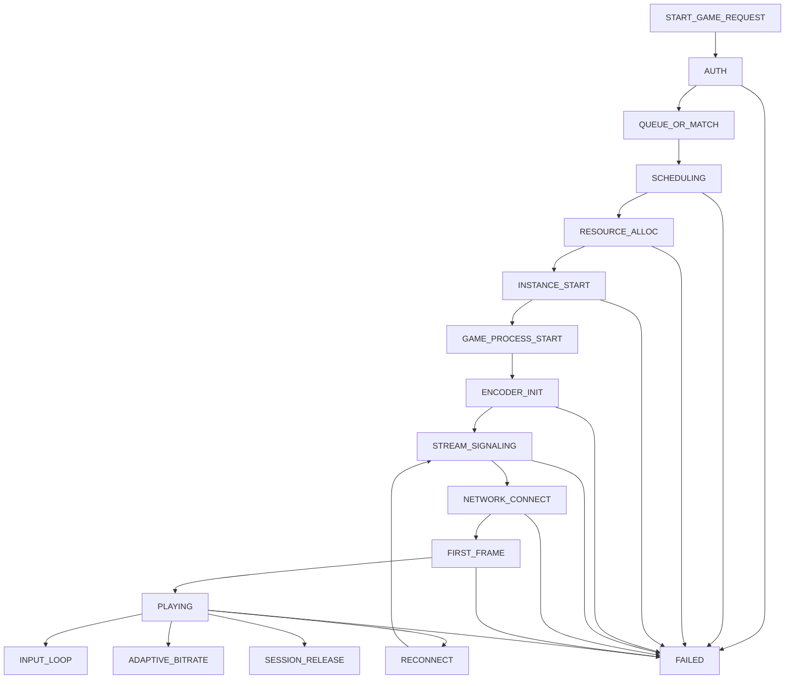
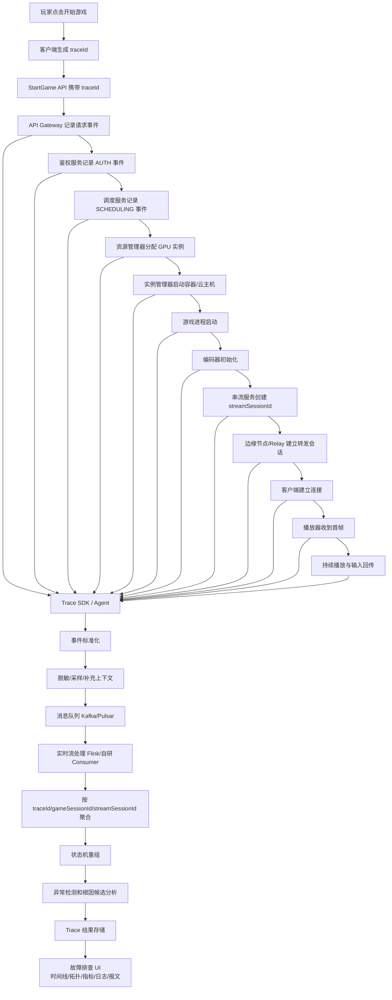
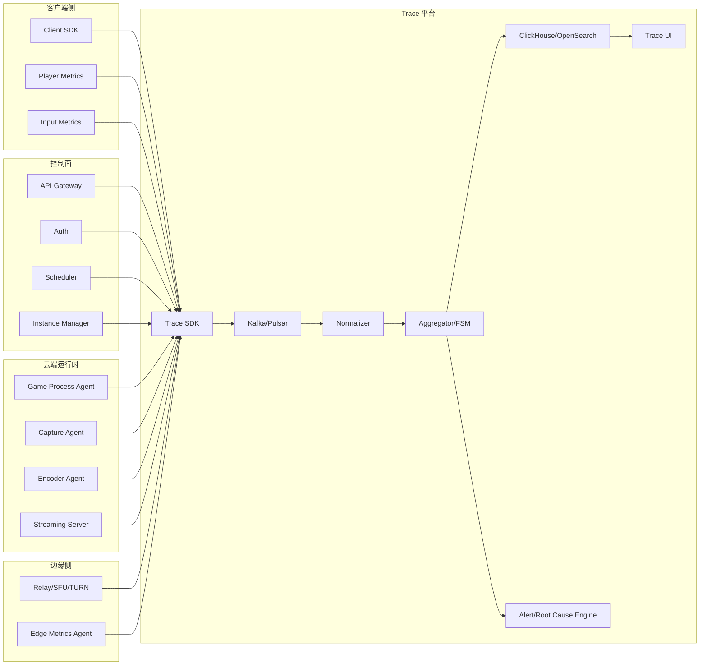

可以把核心网 CallTrace 的思想迁移成一套 **CloudGameTrace / SessionTrace** 系统，用来排查云游戏串流链路故障。
核心思想是：
>以“玩家一次游戏会话”为中心，把从客户端、调度、容器/云主机、游戏进程、编码器、网络传输、边缘节点、播放器、输入回传等环节的事件串成一条端到端时间线。


----
# 1. 从核心网 CallTrace 到云游戏 Trace 的映射


|核心网CallTrace|云游戏业务对应物|
|:-:|:-:|
|用户 IMSI / SUPI|userId / accountId / deviceId|
|一次注册 / 上网 / 呼叫|一次云游戏启动 / 串流 / 操作 / 断连|
|AMF / SMF / UPF|调度服务 / 游戏实例 / 串流网关 / 边缘节点|
|PDU Session|Game Session / Stream Session|
|TEID / Call-ID / Session-ID|sessionId / streamId / roomId / rtcConnectionId|
|信令流程|启动、排队、拉起实例、建连、推流、输入回传|
|cause code|errorCode / closeReason / networkReason / decoderError|
|CallTrace 时间线|CloudGameTrace 会话时间线|
你的云游戏 Trace 不应该只看“播放器报错”或者“服务端日志”，而应该把一次用户会话拆成完整链路：
```
用户点击开始游戏
 -> 账号鉴权
 -> 资源调度
 -> 分配游戏实例
 -> 游戏进程启动
 -> 编码器初始化
 -> 推流通道建立
 -> 客户端拉流
 -> 首帧到达
 -> 持续串流
 -> 输入回传
 -> 弱网/卡顿/黑屏/断连
 -> 会话释放
```

----
# 2. 云游戏链路中的 Trace 采集点

你可以把采集点分成 8 类。
## 2.1 客户端 Client

采集玩家侧体验和播放状态。
```
App 启动
登录状态
点击开始游戏
排队等待
连接状态
DNS 解析耗时
WebSocket / QUIC / WebRTC 建连耗时
首帧耗时
播放器状态
解码耗时
渲染帧率
卡顿次数
音视频同步
输入延迟
丢包率
RTT
码率
分辨率
断连原因
```
客户端是最重要的体验源，因为用户最终感知的是它。


----
## 2.2 接入网关 / API Gateway

采集业务请求入口。
```
startGame 请求
鉴权结果
用户区域
设备类型
客户端版本
调度请求耗时
返回的 sessionId
返回的 edgeId
返回的 streamUrl
```

----
## 2.3 调度系统 Scheduler

采集资源选择逻辑。
```
选择机房
选择边缘节点
选择 GPU 池
选择游戏实例类型
排队时长
调度失败原因
资源不足原因
亲和性策略
距离/延迟评估
```
很多云游戏问题不是串流层问题，而是调度阶段就已经异常，比如把新加坡用户调到了日本节点，或者 GPU 池资源不足导致启动慢。


----
## 2.4 游戏实例 / 容器 / 云主机

采集云端实例生命周期。
```
实例创建
镜像拉取
容器启动
GPU 绑定
游戏进程启动
游戏进程 ready
游戏崩溃
进程退出码
CPU 使用率
GPU 使用率
显存使用率
磁盘 IO
实例健康状态
```

----
## 2.5 编码器 Encoder

采集云端画面编码状态。
```
编码器初始化
编码格式 H264/H265/AV1
编码分辨率
目标码率
实际码率
编码 FPS
编码耗时
编码队列积压
关键帧间隔
硬编错误
GPU encoder saturation
```

编码器异常经常导致：
```
黑屏
首帧慢
花屏
帧率不稳
码率抖动
```

----
## 2.6 串流传输层 Stream Transport

可能是 WebRTC、QUIC、UDP 私有协议、RTMP、SRT 等。
采集：
```
连接建立
ICE 状态
DTLS/SRTP 状态
QUIC connectionId
WebRTC peerConnectionId
candidate pair
RTT
jitter
packet loss
retransmission
NACK
PLI/FIR
bandwidth estimate
send bitrate
receive bitrate
拥塞控制状态
```

----
## 2.7 边缘节点 / Relay / SFU / TURN

如果你的架构中有边缘转发节点，要采集：
```
relay session 创建
上下游连接状态
用户到边缘 RTT
边缘到云主机 RTT
上下行丢包
转发队列
buffer 水位
带宽限制
节点负载
转发失败原因
```
边缘节点很适合作为 Trace 聚合中的关键节点，因为它通常同时能看到客户端侧和服务端侧的网络质量。


----
## 2.8 输入回传 Input Channel

云游戏和普通视频最大的区别是有强交互输入。
要单独 trace：
```
按键事件产生时间
客户端发送时间
服务端接收时间
游戏进程消费时间
画面反馈帧编码时间
反馈帧到达客户端时间
```
这可以形成一个闭环：
```
Input -> Game Process -> Render -> Encode -> Network -> Decode -> Display
```
这是云游戏最关键的“操作到显示延迟”。


----
# 3. 最关键的 Trace 关联键设计

核心网里靠 IMSI、GUTI、TEID、Call-ID 聚合。
云游戏里你需要设计自己的关联字段。
## 3.1 全局 Trace ID

强烈建议你在用户点击“开始游戏”的那一刻生成一个全局 traceId。
```
traceId = 一次用户启动云游戏流程的全局追踪 ID
```
贯穿所有服务：
```
Client
API Gateway
Auth
Scheduler
Game Instance Manager
Streaming Server
Encoder
Relay
Player
Input Service
Billing
```
这比核心网容易，因为你可以主动设计 traceId。


----
## 3.2 会话级 ID

建议至少有这些 ID：
```
traceId              // 一次完整启动和串流链路
gameSessionId        // 一次游戏业务会话
streamSessionId      // 一次音视频串流会话
connectionId         // 一次网络连接
instanceId           // 云端游戏实例
containerId          // 容器 ID
hostId               // 物理机 / GPU 机器
edgeNodeId           // 边缘节点
playerId / userId    // 用户
deviceId             // 设备
requestId            // 单个 API 请求
```
一次游戏过程中可能发生重连，所以需要区分：
```
gameSessionId = 整局游戏会话
streamSessionId = 每次串流连接
connectionId = 每次底层网络连接
```
例如：
```
gameSessionId: G123
streamSessionId: S1, S2, S3
connectionId: C1, C2, C3
```
这样用户重连三次时，你不会把所有连接混在一起。


----
# 4. 推荐的事件模型

统一事件模型非常重要。
可以定义一个 CloudGameTraceEvent：
```json
{
  "eventId": "evt-xxx",
  "traceId": "trace-abc",
  "gameSessionId": "game-123",
  "streamSessionId": "stream-456",
  "connectionId": "conn-789",
  "userId": "user-001",
  "deviceId": "device-001",

  "timestamp": "2026-05-09T16:30:10.123+08:00",
  "eventTime": 1778315410123,
  "receiveTime": 1778315410188,

  "service": "scheduler",
  "nodeId": "scheduler-01",
  "region": "sg",
  "az": "sg-a",

  "stage": "SCHEDULING",
  "eventType": "SCHEDULER_SELECT_INSTANCE",
  "direction": "INTERNAL",

  "status": "SUCCESS",
  "errorCode": null,
  "reason": null,

  "latencyMs": 35,

  "attributes": {
    "gameId": "elden-ring",
    "targetRegion": "sg",
    "selectedEdgeNode": "edge-sg-03",
    "selectedHost": "gpu-host-17",
    "queueTimeMs": 1200
  }
}
```
几个关键字段：

|字段|作用|
|:-:|:-:|
|traceId|端到端主线|
|gameSessionId|游戏业务会话|
|streamSessionId|串流会话|
|connectionId|网络连接|
|eventTime|事件真实发生时间|
|receiveTime|平台收到事件时间|
|stage|链路阶段|
|eventType|具体事件|
|status|成功 / 失败 / 超时|
|errorCode|统一错误码|
|attributes|协议或业务特有字段|


----
# 5. 云游戏 Trace 的阶段状态机

建议把一次云游戏会话拆成这些阶段：
```
AUTH
MATCH / QUEUE
SCHEDULING
RESOURCE_ALLOC
INSTANCE_START
GAME_PROCESS_START
ENCODER_INIT
STREAM_SIGNALING
NETWORK_CONNECT
FIRST_FRAME
PLAYING
INPUT_LOOP
ADAPTIVE_BITRATE
RECONNECT
SESSION_RELEASE
```
可以做成状态机。

每个阶段都应该有：
```
开始事件
成功事件
失败事件
超时判断
耗时指标
失败原因码
```
例如：
```
INSTANCE_START_BEGIN
INSTANCE_START_SUCCESS
INSTANCE_START_FAILED
INSTANCE_START_TIMEOUT
```

----
# 6. 完整执行流程图

下面是迁移后的 CloudGameTrace 完整链路。


----
# 7. 一次成功启动的 Trace 时间线

UI 里可以展示成这样：
```
TraceId: trace-abc
UserId: user-001
Game: xxx
Region: Singapore
Result: SUCCESS

[00ms]   CLIENT_START_GAME_CLICK
[15ms]   API_GATEWAY_RECEIVED
[42ms]   AUTH_SUCCESS
[130ms]  SCHEDULER_SELECTED_EDGE edge-sg-03
[280ms]  GPU_INSTANCE_ALLOCATED gpu-host-17
[950ms]  CONTAINER_STARTED
[1820ms] GAME_PROCESS_READY
[1940ms] ENCODER_INIT_SUCCESS h265 1080p
[2010ms] STREAM_SESSION_CREATED
[2180ms] WEBRTC_ICE_CONNECTED
[2300ms] FIRST_PACKET_SENT
[2460ms] FIRST_FRAME_RENDERED
[3000ms] PLAYING bitrate=12Mbps fps=60 rtt=28ms loss=0.2%
```
这样你可以直接看到：
```
启动总耗时 = 2460ms
最慢阶段 = 游戏进程启动 870ms
首帧耗时 = 2460ms
调度耗时 = 88ms
网络建连耗时 = 170ms
```

----
# 8. 一次失败 Trace 的例子

比如用户反馈“黑屏”。
Trace 展示：
```
TraceId: trace-def
UserId: user-002
Game: xxx
Result: FAILED
Symptom: BLACK_SCREEN

[00ms]   CLIENT_START_GAME_CLICK
[36ms]   AUTH_SUCCESS
[122ms]  SCHEDULER_SELECTED_EDGE edge-sg-02
[330ms]  GPU_INSTANCE_ALLOCATED gpu-host-08
[1100ms] CONTAINER_STARTED
[1850ms] GAME_PROCESS_READY
[1920ms] ENCODER_INIT_SUCCESS
[2050ms] STREAM_SESSION_CREATED
[2300ms] WEBRTC_CONNECTED
[2500ms] FIRST_PACKET_SENT
[8000ms] CLIENT_FIRST_FRAME_TIMEOUT
[8020ms] PLAYER_STATE_BLACK_SCREEN
```
再结合服务端指标：
```
encoder_fps = 60
send_bitrate = 8Mbps
edge_out_bitrate = 8Mbps
client_recv_bitrate = 0Mbps
```
就能推断：
```
服务端已经编码并发送
边缘节点有出口流量
客户端没有收到
根因候选：客户端网络 / NAT / 运营商链路 / Relay 到 Client 路径异常
```
如果是：
```
encoder_fps = 0
send_bitrate = 0
game_process_ready = true
```
则更像：
```
编码器没有拿到画面 / Capture 异常 / GPU 编码异常
```

----
# 9. MQ 是否需要？建议需要

建议你的架构里使用 MQ。
推荐链路：
```
Trace SDK / Agent / Probe
        |
        v
Kafka / Pulsar
        |
        v
实时聚合 Consumer
        |
        v
ClickHouse / Elasticsearch / OpenSearch
        |
        v
Trace UI
```
MQ 的 topic 可以这样设计：
```
cloudgame.trace.raw.client
cloudgame.trace.raw.gateway
cloudgame.trace.raw.scheduler
cloudgame.trace.raw.instance
cloudgame.trace.raw.encoder
cloudgame.trace.raw.stream
cloudgame.trace.raw.edge
cloudgame.trace.normalized
cloudgame.trace.session
cloudgame.trace.alert
```
Kafka message key 推荐：
```
traceId
```
或者：
```
gameSessionId
```
这样同一个会话的事件尽量进入同一个分区，降低聚合复杂度。


----
# 10. 实时聚合怎么做？

可以用 Flink / Kafka Streams / 自研 Go Consumer。
聚合逻辑大致是：
```
消费 normalized event
 -> 按 traceId 分组
 -> 放入状态缓存
 -> 按 eventTime 排序
 -> 根据状态机推进阶段
 -> 计算阶段耗时
 -> 判断超时 / 缺失 / 错误码
 -> 输出 session trace 结果
```
伪代码：
```
type TraceAggregator struct {
    stateStore TraceStateStore
    fsm        GameSessionFSM
}

func (a *TraceAggregator) OnEvent(event TraceEvent) {
    trace := a.stateStore.GetOrCreate(event.TraceID)

    trace.Append(event)
    trace.SortByEventTime()

    a.fsm.Apply(trace, event)

    if a.fsm.IsTimeout(trace) {
        trace.MarkTimeout()
    }

    if event.Status == "FAILED" {
        trace.MarkFailed(event.Stage, event.ErrorCode, event.Reason)
    }

    if trace.IsCompleted() || trace.IsExpired() {
        result := BuildTraceResult(trace)
        SaveTraceResult(result)
        a.stateStore.Delete(event.TraceID)
    } else {
        a.stateStore.Save(trace)
    }
}
```

----
# 11. 建议重点设计的故障分类

云游戏串流故障可以按阶段分类。
## 11.1 启动类

```
START_GAME_API_TIMEOUT
AUTH_FAILED
QUEUE_TIMEOUT
SCHEDULER_NO_RESOURCE
INSTANCE_ALLOC_FAILED
CONTAINER_START_TIMEOUT
GAME_PROCESS_CRASH
GAME_PROCESS_READY_TIMEOUT
```

----
## 11.2 编码类

```
ENCODER_INIT_FAILED
ENCODER_FPS_ZERO
ENCODER_QUEUE_BLOCKED
GPU_ENCODER_SATURATED
CAPTURE_NO_FRAME
BITRATE_ABNORMAL
KEYFRAME_NOT_GENERATED
```

----
## 11.3 建连类

```
SIGNALING_FAILED
ICE_FAILED
TURN_ALLOC_FAILED
QUIC_HANDSHAKE_FAILED
DTLS_FAILED
STREAM_SESSION_TIMEOUT
```

----
## 11.4 播放类

```
FIRST_FRAME_TIMEOUT
DECODER_INIT_FAILED
DECODE_ERROR
RENDER_ERROR
AUDIO_VIDEO_DESYNC
BLACK_SCREEN
FREEZE
```

----
## 11.5 网络类

```
HIGH_RTT
HIGH_JITTER
HIGH_PACKET_LOSS
BANDWIDTH_DROP
RETRANSMISSION_SPIKE
EDGE_TO_CLIENT_LOSS
HOST_TO_EDGE_LOSS
CONGESTION_CONTROL_LIMITED
```

----
## 11.6 输入类

```
INPUT_CHANNEL_DISCONNECTED
INPUT_RTT_HIGH
INPUT_EVENT_DROPPED
GAME_NOT_CONSUMING_INPUT
INPUT_TO_DISPLAY_LATENCY_HIGH
```

----
# 12. 根因判断可以用“分段对比”

云游戏 Trace 的强大之处在于能把链路切段。
例如串流链路：
```
Game Render
 -> Capture
 -> Encode
 -> Host Send
 -> Edge Receive
 -> Edge Send
 -> Client Receive
 -> Decode
 -> Render Display
```
每段都有指标。
## 黑屏判断示例

```
Game Render FPS > 0
Capture FPS = 0
```
根因候选：
```
采集画面失败
游戏窗口句柄异常
显卡输出异常
```

----
```
Capture FPS > 0
Encoder FPS = 0
```
根因候选：
```
编码器异常
GPU 编码资源不足
编码初始化成功但运行中阻塞
```

----
```
Encoder FPS > 0
Host Send Bitrate > 0
Edge Receive Bitrate = 0
```
根因候选：
```
云主机到边缘链路异常
安全组 / 防火墙 / 路由异常
```

----
```
Edge Send Bitrate > 0
Client Receive Bitrate = 0
```
根因候选：
```
边缘到用户网络异常
NAT / UDP 被阻断
运营商链路异常
```

----
```
Client Receive Bitrate > 0
Client Decode FPS = 0
```
根因候选：
```
客户端解码失败
编码格式不兼容
硬解异常
```

----
```
Client Decode FPS > 0
Client Render FPS = 0
```
根因候选：
```
播放器渲染异常
Surface / Texture / GPU 渲染问题
```

----
# 13. 最小可落地版本

一开始不要做太大，可以先做 MVP。
## 第一阶段：统一 traceId

所有服务都打出：
```
traceId
gameSessionId
streamSessionId
userId
stage
eventType
timestamp
status
errorCode
latencyMs
```
接入这些模块：
```
Client
API Gateway
Scheduler
Instance Manager
Streaming Server
Edge Relay
```

----
## 第二阶段：事件进 Kafka

```
各模块 SDK -> Kafka topic cloudgame.trace.normalized
```
不要一开始就追求所有原始日志都进来，先保证关键事件进来。


----
## 第三阶段：ClickHouse 存储

建议用 ClickHouse 存明细事件，非常适合按 traceId、userId、sessionId、时间范围查。
核心表可以是：
```
CREATE TABLE cloudgame_trace_events
(
    event_time DateTime64(3),
    receive_time DateTime64(3),
    trace_id String,
    game_session_id String,
    stream_session_id String,
    connection_id String,
    user_id String,
    device_id String,
    service String,
    node_id String,
    region String,
    stage String,
    event_type String,
    status String,
    error_code String,
    latency_ms UInt32,
    attributes String
)
ENGINE = MergeTree
PARTITION BY toDate(event_time)
ORDER BY (trace_id, event_time);
```

----
## 第四阶段：做一个 Trace UI

先做最有用的三个视图：
```
1. 时间线 Timeline
2. 阶段耗时瀑布图 Waterfall
3. 链路拓扑图 Topology
```
UI 上一次 Trace 应该能看到：
```
启动耗时
首帧耗时
失败阶段
错误码
服务端 FPS
客户端 FPS
RTT / 丢包 / 抖动
上下游码率
重连次数
实例 ID
边缘节点 ID
```

----
# 14. 推荐的云游戏 Trace 总体架构



----
# 15. 最核心的设计原则

我建议你按这几个原则落地：
## 第一，traceId 必须从客户端开始生成

因为很多问题发生在服务端之前，比如：
```
DNS 慢
连接失败
客户端版本问题
本地解码失败
弱网
```
如果 traceId 只在服务端生成，客户端启动失败时可能根本关联不上。


----
## 第二，区分 gameSessionId 和 streamSessionId

否则重连、切边缘、切码率时很容易串。
```
gameSessionId：一次用户游戏生命周期
streamSessionId：一次串流连接生命周期
connectionId：一次底层网络连接生命周期
```

----
## 第三，事件必须阶段化

不要只上报普通日志。
应该明确：
```
阶段
事件
状态
耗时
失败码
```
例如：
```
stage = FIRST_FRAME
eventType = FIRST_FRAME_RENDERED
latencyMs = 2460
status = SUCCESS
```

----
## 第四，服务端指标和客户端指标要放在同一条时间线

单看服务端，你可能以为正常：
```
server_fps = 60
send_bitrate = 10Mbps
```
但客户端可能是：
```
receive_bitrate = 0
decode_fps = 0
```
这才知道问题在网络下游或客户端。


----
## 第五，必须保留原始日志引用

Trace 事件是摘要，不可能包含所有细节。
建议事件里带：
```
logRef
pcapRef
metricRef
recordingRef
```
例如：
```
{
  "eventType": "ENCODER_INIT_FAILED",
  "errorCode": "GPU_ENCODER_CREATE_FAILED",
  "logRef": "loki://encoder-service?traceId=xxx",
  "metricRef": "prometheus://query?...",
  "dumpRef": "s3://trace-dump/xxx"
}
```
Trace UI 点击事件，可以跳到原始日志或指标。


----
# 16. 最终你要做的系统，本质是这个

```
CloudGameTrace =
    TraceId 贯穿
  + 多端事件采集
  + 统一事件模型
  + MQ 事件总线
  + 流式状态机聚合
  + 阶段耗时分析
  + 串流指标关联
  + 根因候选判断
  + 时间线 UI
```
一句话：
>把一次云游戏会话当成“一次呼叫”，把启动、调度、实例、编码、传输、播放、输入回传都当成“信令和承载过程”，用 traceId、sessionId、connectionId 把它们串起来，形成端到端的故障排查链路。