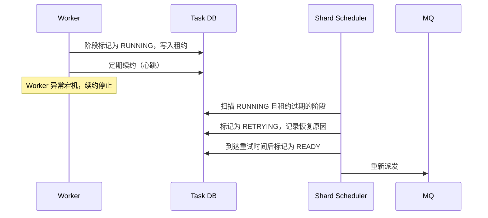
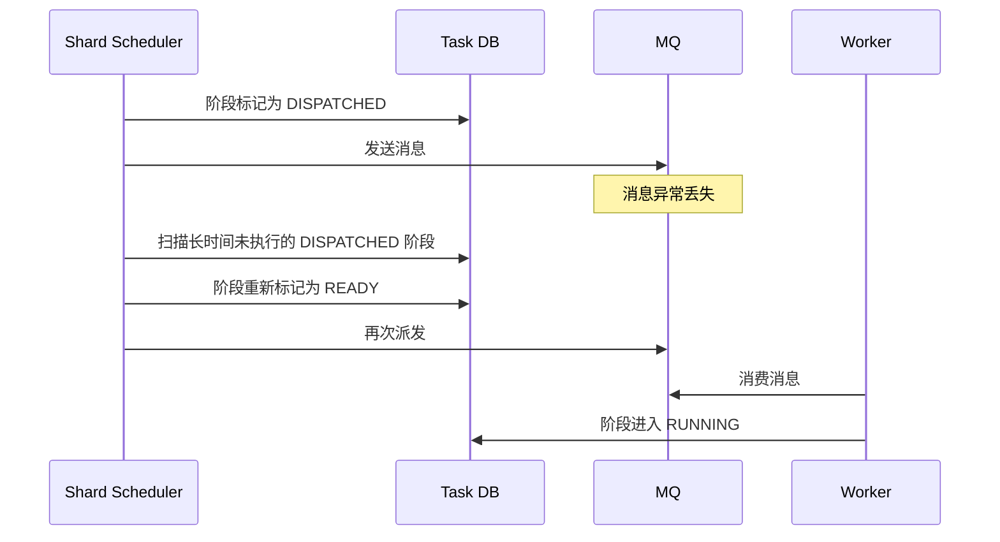
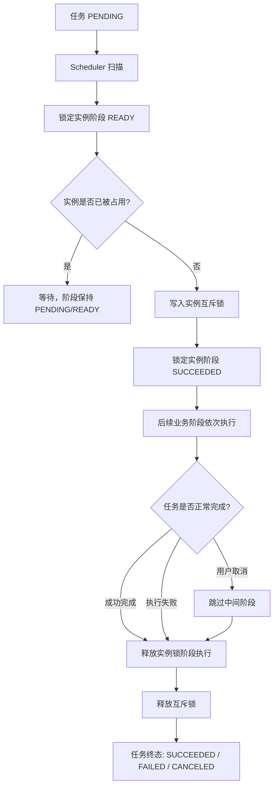

# Shard Scheduler 设计与实例锁机制

状态：草稿
创建日期：2026-05-15
所属项目：`01_Projects/CGInstance 实例任务批处理系统/`
关联文档：`00_Inbox/agent-drafts/CGInstance 实例任务批处理系统技术方案.md`

---

## 一、Shard Scheduler 的定位

Shard Scheduler 是 CGInstance 的调度核心，是连接 DB 状态机与 MQ 执行的枢纽。

系统中的数据流动是：

```
Task DB（状态源）
    ↓ Scheduler 扫描
Shard Scheduler（调度推进）
    ↓ 投递消息
MQ（异步派发）
    ↓ Worker 消费
Worker（执行阶段）
    ↓ 写回结果
Task DB（状态更新）
```

Scheduler 不直接执行任务，也不是最终状态源，它的职责是**基于 DB 的阶段状态，推进任务往前走**。

---

## 二、Shard Scheduler 的核心职责

### 2.1 分片扫描

每个 Scheduler 实例只扫描归属自己的分片，而不是全量扫描所有任务。

分片规则：

```text
shard_id = hash(instance_id) % shard_count
```

Scheduler 扫描时过滤条件：

```sql
WHERE shard_id IN (本 Scheduler 负责的 shard 列表)
  AND stage_status = 'READY'
```

这样可以将扫描压力分散到多个 Scheduler 实例，避免单点竞争和数据库全表扫描。

### 2.2 阶段派发

Scheduler 扫描到 `READY` 状态的阶段后，执行以下步骤：

1. 通过限流检查（全局 → 租户 → 任务类型 → Region/AZ → 下游系统）。
2. 检查实例互斥锁（如需要互斥则检查是否可占用）。
3. 将阶段状态更新为 `DISPATCHED`。
4. 向 MQ 投递阶段执行消息。

`DISPATCHED` 与投递 MQ 需要尽量保证原子性或具备补偿逻辑，避免 DB 已标记但消息未发出的情况（见 2.4 MQ 消息丢失恢复）。

### 2.3 阶段推进

Worker 完成某个阶段后将结果写回 DB。Scheduler 在下次扫描时检测到前一阶段已 `SUCCEEDED`，则将下一阶段从 `PENDING` 推进到 `READY`，触发后续执行。

这是多阶段任务流水线向前推进的核心机制。

```
阶段 A: SUCCEEDED
    ↓ Scheduler 扫描推进
阶段 B: PENDING → READY → DISPATCHED
    ↓ Worker 执行
阶段 B: RUNNING → SUCCEEDED
    ↓ Scheduler 扫描推进
阶段 C: PENDING → READY
```

### 2.4 异常接管：Worker 宕机恢复

Worker 在执行阶段时需持续向 DB 写入心跳（续约）。Scheduler 负责扫描 `RUNNING` 状态但租约已过期的阶段，接管恢复流程：



恢复原则：
- Worker 宕机不等于任务丢失，DB 中任务和阶段状态完整保留。
- 恢复后重新执行的阶段必须支持幂等，避免重复副作用。
- 可通过 `request_id` / `operation_id` 确认外部操作是否已完成。

### 2.5 异常接管：MQ 消息丢失恢复

MQ 只做派发，不作最终状态源。Scheduler 扫描 `DISPATCHED` 状态但长时间未进入 `RUNNING` 的阶段，视为消息丢失，重新派发：



### 2.6 重试调度

Scheduler 扫描 `RETRYING` 状态且重试时间已到的阶段，将其重新标记为 `READY` 并派发。重试使用退避策略（如指数退避），避免对下游产生重试风暴。

---

## 三、Shard Scheduler 的并行模型

### 3.1 并行层次

Scheduler 的并行存在三个层次，需要明确区分：

| 层次 | 并行情况 | 约束机制 |
|---|---|---|
| 不同 Scheduler 实例之间 | **完全并行**，各自负责不同 shard | 分片规则隔离，互不干扰 |
| 同一 Scheduler 内不同实例的任务 | **并行派发**，不同 instance_id 的阶段同时推进 | 无约束，天然并行 |
| 同一实例的互斥任务之间 | **必须串行**，同时只能一个互斥任务占用实例 | 分片 + 实例互斥锁 |

### 3.2 分片 ≠ 实例互斥

这是一个容易误解的关键点：

- **分片的作用**：保证同一 `instance_id` 的所有任务永远落在同一个 Scheduler 实例处理，从而在逻辑上限定调度范围。
- **分片不能替代互斥锁**：即使在同一 Scheduler 内，同一实例的两个互斥阶段也可能在同一次扫描中同时被推进为 `READY`，进而被并发派发。

因此，**分片和实例互斥锁必须同时存在**，分别解决不同问题：

```
分片  →  缩小竞争范围，提高扫描效率，降低跨节点锁竞争
互斥锁 →  同一实例同一时间只有一个互斥任务可以执行
```

### 3.3 Scheduler 扫描的控制参数

Scheduler 的扫描循环需要有以下控制参数，避免失控：

| 参数 | 说明 |
|---|---|
| 扫描间隔 | 每轮扫描的间隔时间，防止空转 CPU 过高 |
| 批量大小 | 每次扫描最多处理多少条阶段，控制单次 DB 压力 |
| 租约超时阈值 | 多久未续约视为 Worker 宕机 |
| DISPATCHED 超时阈值 | 多久未进入 RUNNING 视为消息丢失 |
| 重试退避策略 | 指数退避或固定间隔，最大重试次数 |

---

## 四、实例锁机制

### 4.1 加锁时机

**在任务第一个需要互斥保护的阶段开始执行前，以独立的"锁定实例"阶段完成加锁。**

从制作系统镜像任务的阶段流程可以看到：

```
任务创建 → [锁定实例] → 前置检查 → 停止实例 → 调用 IaaS 制作系统镜像 → 校验镜像 → 启动实例 → [释放实例锁] → 任务完成
```

锁定实例是任务执行的第一个阶段，而不是在任务 `PENDING` 时就加锁。

**为什么不在任务创建时加锁？**

- 任务创建后可能等待较长时间（被限流、等待前置依赖、调度资源不足），创建即加锁会导致实例被占用而不执行任何操作，阻塞其他任务。
- 把锁定本身设计为一个阶段，失败可重试，状态可观测，符合整体阶段化设计。
- 如果加锁阶段失败（例如实例已被占用），任务可以等待或返回明确错误，而不是在 DB 中产生一个无效的锁记录。

### 4.2 释放时机

**释放实例锁作为任务的最后一个必须执行的阶段，在所有业务逻辑完成后执行。无论任务成功、失败还是取消，均必须执行。**

释放实例锁阶段具有特殊属性：**不可跳过，不可取消**。

从取消流程的阶段适配可以看到：

| 阶段 | 是否适合取消 |
|---|---|
| 前置检查 | 可以取消 |
| 镜像制作 | 视下游能力决定 |
| 镜像分发 | 部分可取消 |
| 释放实例锁 | **不建议取消，必须执行** |

当任务进入 `CANCELING` 状态时，Scheduler 推进逻辑应跳过中间业务阶段，但必须保留并执行清理阶段（释放实例锁）。

### 4.3 加锁与释放的完整生命周期



### 4.4 实例锁的存储方式

实例互斥锁可以有两种实现方式，各有取舍：

**方式一：DB 记录锁**

在任务表或专用的实例锁表中记录当前占用该实例的 `task_id`：

```sql
-- 实例锁表示意
instance_id  | locked_by_task_id | locked_at | lock_expire_at
```

- 优点：状态持久，随 Task DB 一致，可查询，可审计。
- 缺点：每次检查需要查 DB，高频场景下有压力。
- 建议：主互斥保障使用 DB 记录锁，配合分片保证同一实例只有一个 Scheduler 处理。

**方式二：Redis 分布式锁**

使用 `SETNX` 或 Redlock 在 Redis 中维护实例锁：

- 优点：性能高，TTL 自动过期防止死锁。
- 缺点：Redis 重启或网络抖动可能导致锁状态与 DB 不一致，需要额外补偿逻辑。

**推荐**：以 DB 记录锁为主，保证状态一致性；Redis 作为辅助加速检查，不作为唯一互斥保障。

### 4.5 锁泄漏防护

实例锁最危险的场景是**锁泄漏**：任务异常结束，但释放实例锁阶段未执行，导致实例被永久占用。

防护措施：

1. **协作式取消**：取消时 Worker 必须完成清理阶段再退出，不能被强杀。
2. **锁超时兜底**：实例锁设置最大持有时间（`lock_expire_at`），超时后自动释放，防止死锁。
3. **Scheduler 扫描兜底**：Scheduler 定期扫描长时间持有锁但任务已终态的实例，强制释放。
4. **告警监控**：对锁持有超过阈值的实例发出告警，人工介入排查。

---

## 五、踩坑总结

| 踩坑 | 后果 | 正确做法 |
|---|---|---|
| 只靠分片，不加实例互斥锁 | 同一实例的互斥任务可能在同一 shard 内并发执行 | 分片 + 互斥锁同时存在 |
| 任务创建时就加锁 | 实例被长时间占用但不执行，阻塞其他任务 | 加锁作为第一个执行阶段 |
| 取消时强杀 Worker | 释放实例锁阶段被跳过，实例锁泄漏 | 协作式取消，清理阶段必须执行 |
| 释放锁阶段允许取消 | 任务取消后实例锁残留 | 释放锁阶段标记为不可取消 |
| 实例锁无超时兜底 | Worker 宕机或异常时锁永久残留 | 设置 `lock_expire_at` 并由 Scheduler 兜底扫描 |

---

## 六、与其他模块的关系

```
Shard Scheduler
    ├── 依赖 Task DB：读取阶段状态、更新状态、检查实例互斥锁
    ├── 依赖 MQ：派发阶段执行消息
    ├── 依赖 限流模块：控制派发速率
    └── 依赖 实例互斥锁：控制同一实例的串行化

实例互斥锁
    ├── 由 Scheduler 在派发前检查
    ├── 由 Worker 在执行"锁定实例"阶段时写入
    ├── 由 Worker 在执行"释放实例锁"阶段时释放
    └── 由 Scheduler 超时兜底扫描释放
```

---

## 七、待确认项

- Scheduler shard 归属机制：静态分配、租约抢占还是一致性哈希？
- Scheduler 宕机后 shard 接管的切换延迟是否可接受？
- 实例锁的存储选型：DB 记录锁、Redis 锁还是两者结合？
- 实例锁的最大持有时间阈值如何定义？不同任务类型的持有时间差异大。
- "释放实例锁"阶段是否需要区分"正常释放"和"补偿释放"两种路径？
- 同一实例并发提交多个互斥任务时，等待队列如何管理（先进先出还是优先级）？

---

## 来源

- `00_Inbox/agent-drafts/CGInstance 实例任务批处理系统技术方案.md`
- 用户在 2026-05-15 针对 Shard Scheduler 作用、并行模型、实例锁加锁与释放时机的追问。
- 本文由 Agent 在 2026-05-15 基于上述对话细化整理。

## 假设

- Scheduler 使用 DB 轮询扫描方式驱动阶段推进，而非事件驱动。
- 实例互斥锁以 DB 记录锁为主要实现方式。
- Worker 支持定期续约和协作式取消。
- 分片数量在系统初始化时确定，暂不考虑动态热分片。
