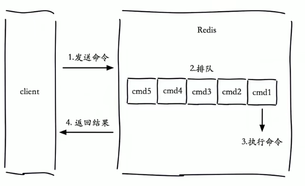
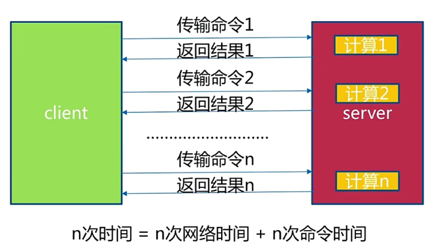
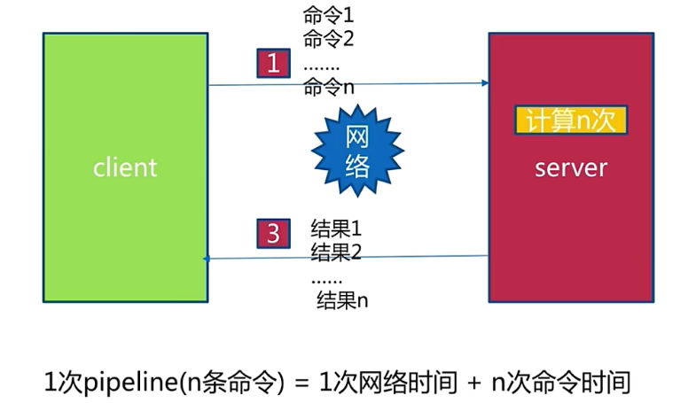
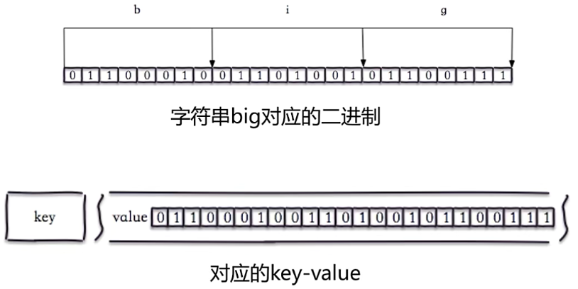
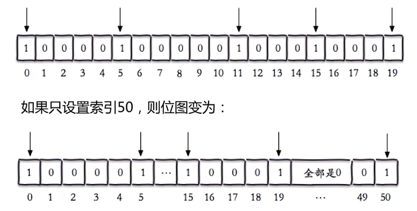
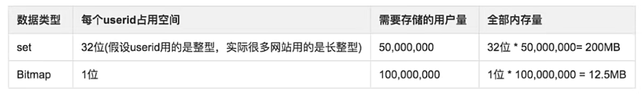
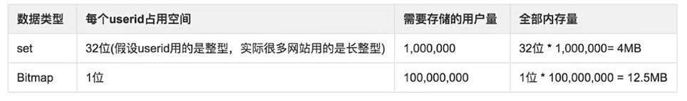
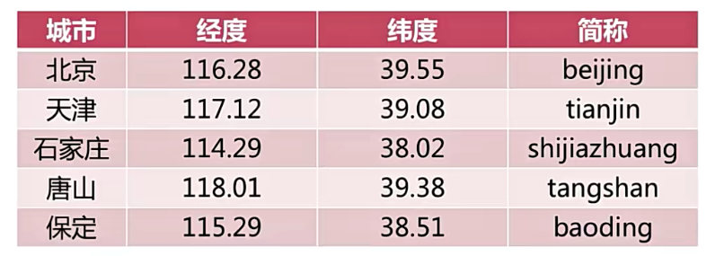

# 02 | Redis其他功能

## 一、慢查询

### 1. 生命周期



- 发送命令
- 排队
- 执行命令
- 返回结果

> 慢查询发生在第三阶段；客户端超时不一定慢查询，但慢查询时客户端超时的一个可能因素


### 2. 两个配置

**slowlog-max-len**

- 慢查询是一个先进先出的队列，假如一条命令在第三步时被列入慢查询的范围，就会被记录进一个队列
- 这个记录队列是固定长度的，也就是说这个记录队列满了后，最先被记录的慢查询就会被丢弃
- 这些记录都保存在内存中，重启Redis后，记录会丢失


**slowlog-log-slower-than**

- 慢查询阈值，超过了这个阈值就会被记录到慢查询队列中(单位：微秒, 1毫秒=1000微秒)
- slowlog-log-slower-than=0, 记录所有命令
- slowlog-log-slower-than<0, 不记录任何命令


**配置方法**

默认值：

- config get slowlog-max-len=128
- config get slowlog-log-slower-than=10000

修改配置文件重启

动态配置：

- config set slowlog-max-len 1000
- config get slowlog-log-slower-than 1000


### 3. 慢查询命令

- slowlog get [n]：获取慢查询队列
- slowlog len: 获取慢查询队列长度
- slowlog reset: 清空慢查询队列


### 4. 经验

- showlog-max-len 不要设置过大，默认10ms,通常设置1ms
- slowlog-log-slower-than 不要设置过小，通常设置1000左右
- 定期持久化慢查询(慢查询队列存放在内存中，并且是一个先进先出的队列)


## 二、pipeline

### 1. 批量网络命令通信模型



Redis命令时间是非常快的，所以优化网络时间可以优先减少命令延时。我们可以用`mget`、`mset`这样的命令一次获取或一次设置多条记录，但是Redis没有提供一次操作多个`hset`这样的操作，或者我们想同时执行`get`和`hget`也没办法直接实现。

所以就有了pipeline，它可以将一批命令打包，发送给server，server批量计算，然后按顺序批量发送给client



> Tips：
>
> - Redis的命令时间是微秒级别
> - pipeline每次条数要控制(网络)


**举个例子：**

北京到上海市1300km，光速是30000km/s，光纤传输速度约等于光速的2/3

一条命令的传输时间：

```
(1300*2)/(30000*2/3)=13毫秒
```

### 2. 与m操作对比

- m操作是一个原子操作
- pipeline会将命令进行拆分，非原子操作


### 3. 使用建议

- 注意每次pipeline携带数据量
- pipeline每次只能作用在一个Redis节点上
- 理解M操作与pipeline的区别


## 三、发布订阅

### 1. 角色

- 发布者(publisher)
- 订阅者(subscriber)
- 频道(channel)


注意：没有消息堆积的功能，历史消息，后续订阅的订阅者无法获取


**publish**

```bash
# publish channle message
# 发布命令
10.0.0.12:db0> publish sohu:tv "helloworld"
0  # 订阅者个数


```

**subcriber**

```bash
# subscriber [channle] # 一个或多个
# 订阅频道

10.0.0.12:db0> subscribe sohu:tv
1) "subscribe"
2) "sohu:tv"
3) 1
1) "message"
2) "sohu:tv"
3) "helloworld"
```

**unsubscribe**

```bash
# unsubscribe [channel] # 一个或多个
# 取消订阅
10.0.0.12:db0> unsubscribe sohu:tv
1) "unsubscribe"
2) "sohu:tv"
3) 0
```

**其他API:**

> 1. psubscribe [pattern...] # 订阅模式
> 2. punsubscribe [pattern...] # 退订指定的模式
> 3. pubsub channels # 列出至少有一个订阅者的频道
> 4. pubsub numsub [channel] # 列出给定频道的订阅者数量


### 2. 消息队列 与 发布订阅

- 消息队列是消费者去队列中抢消息，只有一个消费者获得消息
- 发布订阅是所有订阅者都会获得发布的消息


## 四、Bitmap



> 在Redis中，可以直接操作位

### 1. API

**setbit**

```bash
# setbit key offset value
# 给位图制定索引设置值(offset 是偏移量，value只能是0或1)

10.0.0.12:db0> set hello big
OK
10.0.0.12:db0> getbit hello 0
0
10.0.0.12:db0> getbit hello 1
1
10.0.0.12:db0> setbit hello 7 1
0   # 返回之前位对应的值
10.0.0.12:db0> get hello
cig
```



> 所以在做 `setbit` 操作时，不要在很短的位图上，突然偏移量非常大


**getbit**

```bash
# getbit key offset 
# 获取位图指定索引的值

10.0.0.12:db0> getbit hello 1
1
```

**bitcount**

```bash
# bitcount key [start end]
# 获取位图指定范围(start 到 end, 单位为字节，如果不指定就是获取全部)位值为1的个数

10.0.0.12:db0> bitcount hello
13
```

**bitop**

```bash
# bitop op destkey key [key...]
# 做多个Bitmap的and(交集)、or(并集)、not(非)、xor(异或)操作并将结果保存到destkey中

10.0.0.12:db0> bitop and dest hello world
4
```

**bitpos**

```bash
# bitpos key targetBit [start] [end]
# 计算位图指定范围(start 到 end, 单位为字节，如果不指定就是获取全部)第一个偏移量对应的值等于targetBit的位置

10.0.0.12:db0> bitpos hello 1 
1
```

### 2. 独立用户统计

- 使用set和bitmap
- 假如有1亿用户，5千万独立访问




- 如果只有10万独立用户




### 3.Tips

- bitmap其实就是一个string，最大512MB
- 对于大部分使用场景512MB可以满足，无法满足的情况下，可以将key进行拆分，使用多个key实现这个功能
- 注意setbit时的偏移量，可能有较大耗时
- 位图不是绝对的好

## 五、HyperLogLog

- 基于HyperLogLog算法：极小空间完成独立数量统计
- 本质还是字符串


### 1. API

**pfadd**

```bash
# pfadd key element [element...]
# 向hyperloglog添加元素

10.0.0.12:db0> pfadd 2024_04_28:ids "1" "2" "3" "4"
1
```

**pfcount**

```bash
# pfcount key [key...]
# 计算hyperloglog的独立总数

10.0.0.12:db0> pfcount 2024_04_28:ids
4
```

**pfmerge**

```bash
# pfmerge destkey sourcekey [sourcekey...]
# 合并多个hyperloglog
10.0.0.12:db0> pfadd 2024_04_29:ids "1" "2" "3" "80"
1

10.0.0.12:db0> pfmerge dest_hyper 2024_04_28:ids 2024_04_29:ids
OK

# 1 2 3 4 80 一共5个独立数量
10.0.0.12:db0> pfcount dest_hyper
5
```

### 2. 百万独立用户

```bash
elements=""
key="2024_04_28:unique:ids"
for i in `seq 1 1000000`
do
	elements="${elements} uuid-"${i}
	if [[ $((i%1000))==0 ]]
	then
		redis-cli -a "123456" pfadd ${key} ${elements} &> /dev/null
		elements=""
	fi
done
```

### 3.Tips

- 是否能容忍错误？(错误率：0.81%)
- 是否需要单条数据？(无法取出单条数据)


## 六、GEO

GEO：地理信息定位，存储经纬度，一般用于计算两地距离、范围计算等


### 1. 应用场景

- 微信摇一摇
- 计算周边酒店、餐馆


### 2. 五个城市经纬度




### 3. API

**geoadd**

```bash
# geoadd key longitude latitude member [longitude latitude member ...]
# 增加地理位置信息

10.0.0.12:db0> geoadd cities:locations 116.28 39.55 beijing
1
```

**geopos**

```bash
# geopos key member [member]
# 获取地理位置信息

10.0.0.12:db0> geopos cities:locations beijing
1) 1) 116.28000229597092
2) 39.55000072454708
```

**geodist**

```bash
# geodist key member1 member2 [unit]
# 获取两个地理位置的距离
# unit: m米、km千米、mi英里、ft尺

10.0.0.12:db0> geodist cities:locations beijing tianjin km
89.2061
```

**georadius**: 获取指定位置范围内的地理位置信息集合


### 4. Tips

- geo在redis 3.2版本提供
- geo本质是zset类型
- 没有删除API：zrem key member


