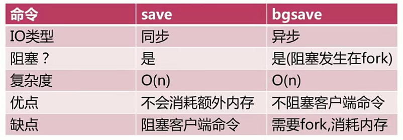
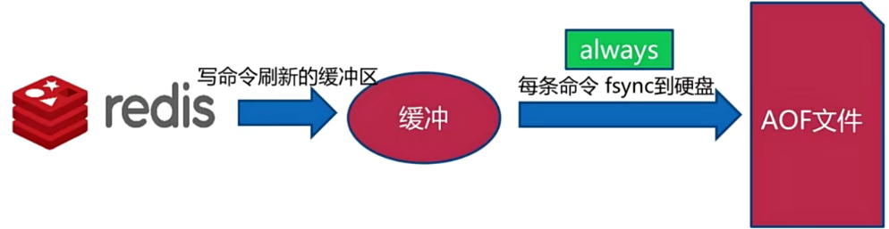
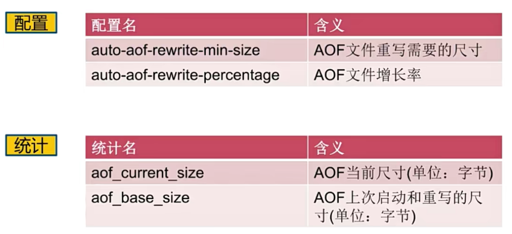
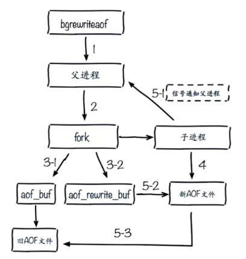

# 03 | Redis运维

## 一、持久化

### 1. 什么是持久化

Redis所有数据保存在内存中，对数据的更新将异步保存到磁盘上。


**主流数据库持久化方式：**

- 快照：数据库某事某点的完整备份(MySQL Dump、Redis RDB)
- 写日志：数据库每次更新都记录到日志中，恢复时只要重走一遍日志操作就能恢复数据(MySQL Binlog、Redis AOF、Hbase Hlog)


### 2. RDB


**触发方式(常用的)：**

- save(同步)
- bgsave(异步)
- 自动


**save**

- 阻塞：在执行save命令时，Redis无法执行其他命令
- 文件策略：如存在老的RDB文件，新替换老
- 复杂度：O(N)


**bgsave**

- fork一个子进程执行createRDB，创建RDB文件
- fork过程会阻塞Redis，createRDB不会阻塞





**自动**

- 在60秒内改变了10000条数据
- 在300秒内改变了100条数据
- 在3600秒内改变了1条数据


```bash
# 执行save或bgsave生成的rdb文件名字
dbfilename dump.rdb

# 生成rdb、aof和日志文件存放路径
dir ./

# 使用bgsave发生错误是否停止写入
stop-writes-on-bgsave-error yes

# rdb文件是否采用压缩格式
rdbcompression yes

# 是否对rdb文件进行校验和检查
rdbchecksum yes
```


**最佳配置：**

```bash
# 执行save或bgsave生成的rdb文件名字
dbfilename dump-${port}.rdb

# 生成rdb、aof和日志文件存放路径
dir /bigdiskpath

# 使用bgsave发生错误是否停止写入
stop-writes-on-bgsave-error yes

# rdb文件是否采用压缩格式
rdbcompression yes

# 是否对rdb文件进行校验和检查
rdbchecksum yes
```


**触发方式(其他方式)：**

- 全量复制
- debug reload
- shutdown


**RDB总结：**

- RDB是Redis内存到硬盘的快照，用于持久化
- save通常会阻塞Redis
- bgsave不会阻塞Redis，但是会fork新进程
- save自动配置满足任一就会被执行
- 有些触发机制不容忽视(其他方式)


### 3. AOF

**RDB有什么问题：**

- 耗时、耗性能：
  - O(N)数据，耗时
  - fork()消耗内存，copy-on-write策略
  - disk I/O
- 不可控、丢失数据


**AOF运行原理：**

- 创建：每执行成功一条更新命令，都会在AOF文件中追加写入这条操作命令
- 恢复：Redis从AOF文件中载入命令进行数据恢复


**AOF三种策略：**

- always
- everysec
- no



> Redis写命令不是直接写到磁盘中，而是写到一个缓冲区，缓冲区会根据一些策略，将命令刷新到磁盘中
>
> - always：每条命令都会刷新到磁盘，不会丢失数据，但是IO开销大
> - everysec：每秒刷新一次，可能会丢失1秒的数据
> - no：由操作系统决定，不可控


AOF重写

AOF会将每条执行成功的更新命令都写入AOF文件中，但是随着Redis稳定运行，AOF文件会逐渐变得非常大，这样我们使用原生的AOF恢复的话就会非常慢，并且在多个Redis之间拷贝也会非常耗时。

所以Redis提供AOF重写策略，将过期数据命令删除，有点类似ETCD磁盘重写

- 减少硬盘占用量
- 加速恢复速度


**AOF重写实现两种方式**

- bgrewriteaof命令
- AOF重写配置


**bgrewriteaof命令**

- 类似bgsave，fork子进程异步完成AOF重写
- AOF重写不是读取AOF文件进行重新，而是从Redis内存中读取数据进行重新


**AOF重写配置**



同时满足：

- aof_current_size > auto-aof-rewrite-min-size
- aof_current_size - aof_base_size_size/aof_base_size > auto-aof-rewrite-percentage


重写流程




**AOF配置：**

```bash
# 使用AOF功能就需要将它打开
appendonly yes

# 类似RDB中的 dbfilename
appendfilename "appendonly-${port}.aof"

# AOF同步策略
appendfsync everysec

# 保存目录
dir /bigdiskpath

# AOF重写的时候是否不做正常AOF append操作
no-appendfsync-on-rewrite yes

# AOF重写配置
auto-aof-rewrite-percentage 100
auto-aof-rewrite-min-size 64mb
```


### 4. RDB和AOF的抉择

**RDB与AOF对比：**


RDB最佳策略

```
默认关RDB备份
集中管理(使用脚本在每天凌晨1点备份一次)
```


AOF最佳策略

```
开：缓存和存储，一般设置1秒一次刷盘
AOF重写集中管理
everysec
```


最佳策略

```
小分片
监控(磁盘、内存、负载、网络)
足够的内存
```


## 二、开发运维常见问题

### 1. fork操作

- 同步操作：只是做内存页的拷贝，而非内存，所以大部分情况都非常快，但是如果它卡住则会导致Redis也卡住
- 与内存量相关：内存越大，耗时越长(与机器也有关)
- info:latest_fork_usec

```bash
10.0.0.11:db0> info stats
# Stats
...
latest_fork_usec:0
...
```


**如何改善fork:**

- 优先使用物理机或高效支持fork操作的虚拟化技术
- 控制Redis实例最大可用内存：maxmemory (内存越大，fork时间就越长)
- 合理配置Linux内存分配策略：vm.overcommit_memory=1
- 降低fork频率：例如放宽AOF重写自动触发时机，不用全量复制


### 2. 进程外开销

- CPU

  - 开销：RDB和AOF文件生成，属于CPU密集型
  - 优化：
    - 不做CPU绑定
    - 不和CPU密集型应用部署在一起
    - 单机多部署不要发生大量的AOF和RDB

- 内存

  - 开销：生成子进程，需要fork产生，内存开销，copy-on-write

    > 理论上子进程占用内存等于父进程，但是Linux有一个copy-on-write(写时复制)，父子进程会共享相同的内存页，当父进程写请求的时候会创建一个副本，相当于这个时候才会消耗内存，而在这个期间，子进程会和共享fork时父进程的内存快照，所以在做AOF重写或bgsave时，如果父进程内存页有大量内存写入，就会导致子进程内存开销比较大，因为它会做一个副本，如果没有写入，实际开销内存非常小。

  - 优化：

    - echo never > /sys/kernel/mm/transparent_hugepage/enabled     不允许大内存页生成

- 硬盘

  - 开销：AOF和RDB文件写入，可以结合iostat、iotop分析
  - 优化：
    - 不要和高硬盘负载服务部署在一起：存储服务、消息队列等
    - no-appendfsync-on-rewrite = yes   , 在AOF重写时不要再对AOF追加写入
    - 根据写入量决定磁盘类型：例如ssd
    - 单机多实例持久化文件目录可以考虑分盘(cgroup限制)


### 3. AOF追加阻塞


- 主线程将AOF写入AOF缓存区
- AOF同步现场负责每秒同步刷盘(根据策略执行)
- 记录最近一次的同步时间
- 主线程对比上一次AOF同步时间，距离上次同步时间在2秒内，就会直接返回；如果超过2秒，主线程会阻塞，直到同步完成(保证AOF文件安全性的策略)


所以就会出现以下两个问题：

1. 主线程阻塞
2. 设置AOF everysec实际宕机可能丢失不止1秒数据，可能是2秒的数据


**AOF阻塞定位**

- Redis日志


- info persistence

```bash
10.0.0.11:db0> info persistence
# Persistence
...
aof_delayed_fsync: 100
...
```

- 硬盘资源监控


