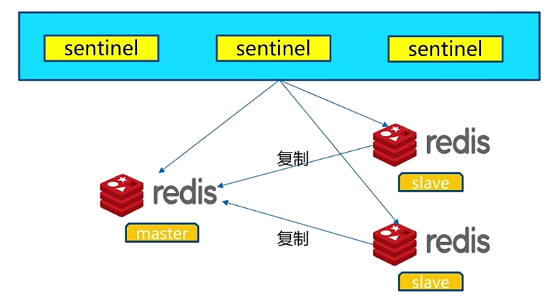
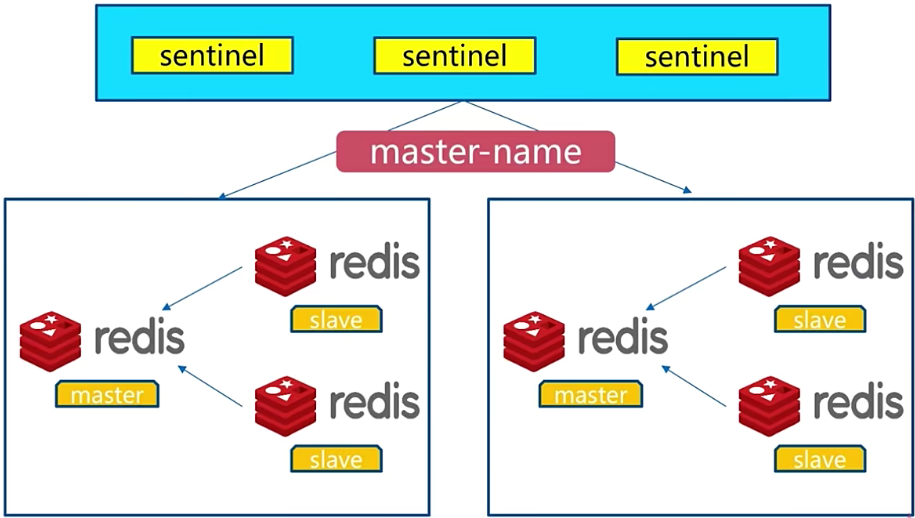
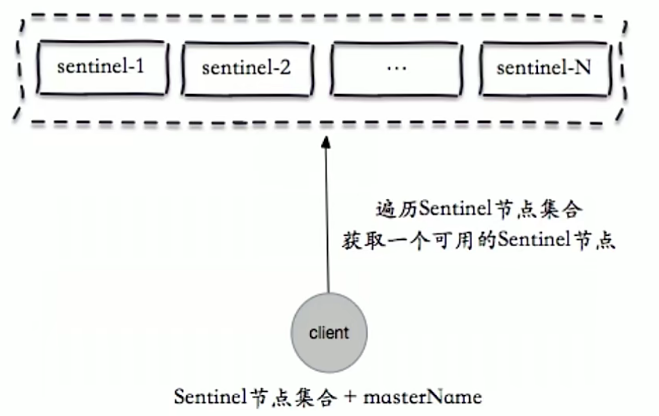
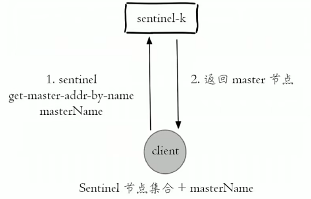
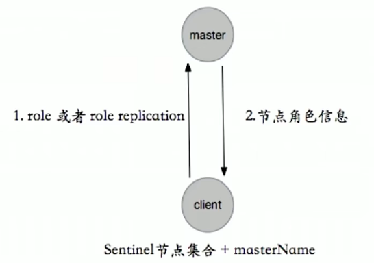
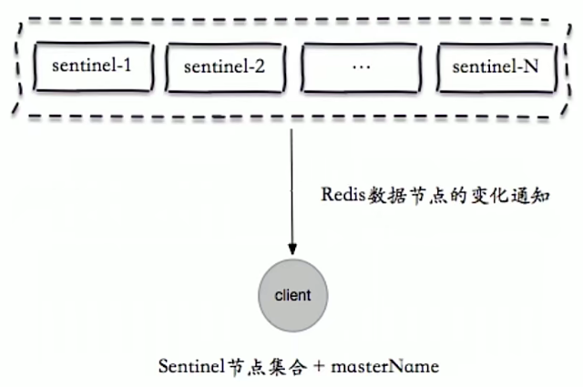
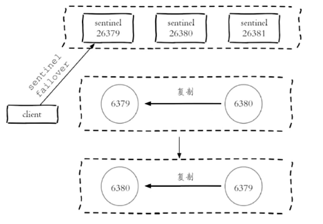
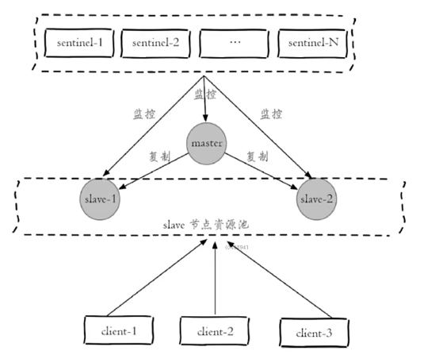

# 04 | Redis 高可用

## 一、Redis 哨兵

### 1. 主从复制高可用

**主从复制存在的问题：**

- 需要手动故障转移
- 写能力和存储能力受限


**master宕机故障处理：**

- slaveof no one: 选择一个新的master
- slaveof new master: 让slave切换到新的master节点


### 2. Redis Sentinel



- client从sentinel获取Redis信息


**Redis Sentinel故障转移：**

- 多个sentinel发现并确认master有问题
- 选举出一个sentinel作为领导
- 选出一个slave作为master
- 通知其他slave成为新的master的slave
- 通知客户端主从变化
- 等待老的master复活成为新master的slave

> 一套Redis Sentinel可以监控多套master-slave，使用master-name进行区分




### 3. 安装与配置

- 配置开启主从节点
- 配置开启sentinel监控主节点(sentinel是特殊的Redis)
- sentinel默认端口是 26379


**Redis主节点：**

```bash
# 启动
redis-server redis-7000.conf

# 配置
port 7000
daemonize yes
pidfile /var/run/redis-7000.pid
logfile "7000.log"
dir "/opt/soft/redis/data/"
```


**Redis从节点：**

```bash
# 启动
redis-server redis-7001.conf
redis-server redis-7001.conf

# slave-1配置
port 7001
daemonize yes
pidfile /var/run/redis-7001.pid
logfile "7001.log"
dir "/opt/soft/redis/data/"
slaveof 127.0.0.1 7000

# slave-2配置
port 7002
daemonize yes
pidfile /var/run/redis-7002.pid
logfile "7002.log"
dir "/opt/soft/redis/data/"
slaveof 127.0.0.1 7000
```


**sentinel配置：**

```bash
port ${port}
daemonize yes
dir "/opt/soft/redis/data/"
logfile "${port}.log"
# 监控master-name是mymaster，地址是127.0.0.1:7000，两个sentinel发现master有问题就会进行故障转移
sentinel monitor mymaster 127.0.0.1 7000 2
# 30000毫秒：30秒不通就会认为master失去连接
sentinel down-after-milliseconds mymaster 30000
# 每次只能并发复制1个，可以减轻master压力
sentinel parellel-syncs mymaster 1
# 故障转移时间
sentinel failover-timeout mymaster 180000
```


**检查：**

```bash
# 查看主从信息
redis-cli -p 7000 info replication

# 去除注释和空行
cat sentinel.conf | grep -v "#" | grep -v "^$" > redis-sentinel.conf
```

> 哨兵通过在主节点上执行`info replication `查看从节点信息


**启动sentinel：**

```bash
redis-sentinel redis-sentinel.conf
```


### 3. 客户端高可用



- 遍历sentinel集合，获取一个可用的sentinel



- 通过master-name从sentinel获取对应master节点地址



- 客户端向master节点发起role请求，验证该节点是否真的是master节点



- 如果master节点故障，sentinel感知后会内部通过发布-订阅模式，立即通知给client，client向新的master发起连接


**客户端连接流程：**

1. sentinel地址集合
2. masterName


### 4. 案例-故障转移

**创建client对redis进行循环写操作：**

- 使用sentinel


**杀死master，模拟故障：**


**查看节点日志：**


### 5. 三个定时任务

第一：每10秒每个sentinel对master和slave执行info

- 先对master节点执行info：发现slave节点
- 确认主从关系


第二：每2秒每个sentinel通过master节点的channel交换信息(pub/sub)

- 通过`__sentinel__:hello`频道交互
- 交互对节点的“看法”和自身信息


第三：每1秒每个sentinel对其他sentinel和redis执行ping

- 心跳检测，失败判定依据


### 6. 主观下线和客观下线

在sentinel的启动配置中有如下配置：

```bash
# 监控master-name是mymaster，地址是127.0.0.1:7000，quorum是法定人数，超过quorum的sentinel认为master失联则判定为客观下线
sentinel monitor <masterName> <ip> <port> <quorum>
sentinel monitor mymaster 127.0.0.1 7000 2
# 30000毫秒：30秒不通就会认为master失去连接，该sentinel判断为master为主观下线
sentinel down-after-milliseconds mymaster 30000
```


- 主观下线：每个sentinel节点对redis节点失败的“偏见”
- 客观下线：所有sentinel节点对redis节点失败“达成共识”(超过quorum个统一)

> quorum建议配置为: `n/2 + 1`，n为sentinel节点数，n最好为奇数


### 7. 领导者选举

- 原因：只有一个sentinel节点完成故障转移

- 选举：通过`sentinel is-master-down-by-addr`命令都希望成为领导者

> sentinel is-master-down-by-addr命令：
>
> - 与其他sentinel交换对master节点的失败判定
> - 进行领导者选举
>
> 
>
> 1. 每个做主观下线的sentinel节点向其他sentinel节点发送命令，要求将它设置为领导者(sentinel-1检查到master节点下线，向sentinel-2和3询问，你们是否同意我成为leader)
> 2. 收到命令的sentinel节点如果没有同意过其他人，那么同意该请求
> 3. 如果该sentinel节点发现自己的票数已经超过sentinel集合半数且超过quorum，那么它将成为领导者
> 4. 如果此过程有多个sentinel成为领导者，那么将等待一段时间重新选举


### 8. 故障转移(sentinel领导者节点完成)

- 从slave节点中选出一个“合适的”节点作为新的master节点
- 对上面的slave节点执行`slaveof no one`命令让其成为master节点
- 向剩余的slave节点发送命令，让它成为新的master节点的slave节点，复制规则和`parallel-syncs`参数有关(切换过程中多个slave切换master，新的master需要生成RDB文件，向多个slave节点发送RDB，parallel-syncs参数就可以限制同时发送RDB文件的个数)
- 更新对原来master节点配置为slave，并保持对其“关注”，当其回复后命令它去复制新的master节点


选择“合适的”slave节点

- 选择`slave-priority`(slave节点优先级)最高的slave节点，如果存在则返回，不存在则继续
- 选择复制偏移量最大的slave节点(复制的最完整：与master更接近)，如果存在则返回，不存在则继续
- 选择runId最小(启动最早)的slave节点


## 二、常见开发、运维问题

### 1. 节点运维

**节点上线和下线：**

- 主节点
- 从节点
- sentinel节点


**主节点下线：**

```
# 手动故障转移
sentinel failover <masterName>
```



**从节点下线：**

- 临时下线还是永久下线，例如做一些清理工作(删除日志、配置等信息)。


**sentinel节点下线：**

- 同上


**节点上线：**

- 主节点：sentinel failover进行替换
- 从节点：slaveof即可，sentinel节点可以感知
- sentinel节点：参考其他sentinel节点启动即可


### 2. 客户端-高可用读写分离

> 从节点下线时，客户端无法感知，无法切换到新的从节点


通过订阅redis频道，获取消息完成切换


**三个“消息”：**

- +switch-master：切换主节点(从节点晋升主节点)
- +convert-to-slave：切换从节点(原主节点降为从节点)
- +sdown：主观下线





## 三、总结

- Redis sentinel是Redis的高可用实现方案：故障发现、故障自动转移、配置中心(客户端从sentinel获取master信息)、客户端通知
- Redis sentinel中sentinel节点个数应该为大于等于3，且最好为奇数
- Redis sentinel中的数据节点与普通数据节点没有区别
- 客户端初始化时连接的是sentinel节点集合，不再是具体的Redis节点，但sentinel只是配置中心不是代理(只在启动时会读取，而不是每次请求都去获取)
- Redis sentinel通过三个定时任务实现了sentinel节点对于主节点、从节点、其余sentinel节点的监控
- Redis sentinel在对节点做失败判定是分为主观下线和客观下线
- Redis sentinel实现读写分离高可用可以依赖sentinel节点的消息通知，获取Redis数据节点的状态变化


