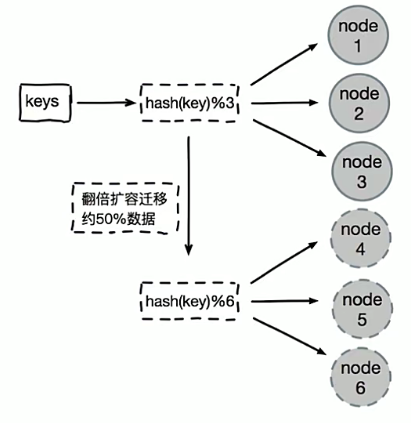
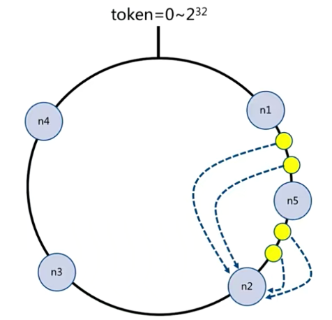
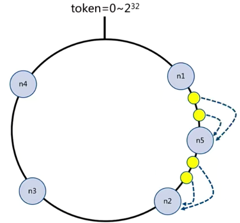
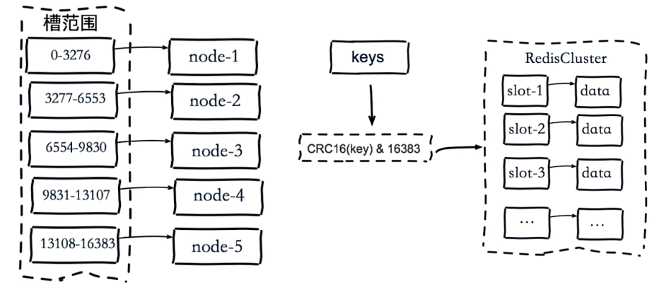
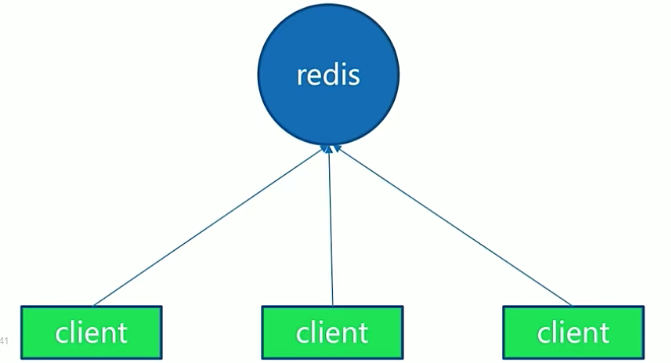
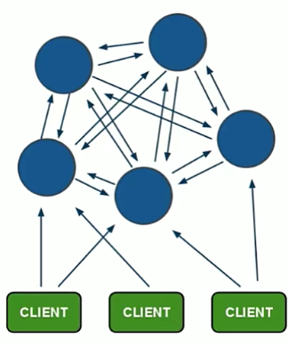

# 05 | Redis Cluster

## 一、为什么需要集群

### 1.问题

**并发量：**

Redis支持 10万/s 的QPS，对于绝大部分业务场景够用了，但是有些业务场景要求 100w/s QPS。 

**数据量：**

一般服务器内存有16G~256G，但是业务要求500G内存。

**网络流量：**

单机网卡假如是千兆网卡，但是业务需求达到万兆

### 2. 解决办法

- 配置性能更强的机器，也就是所谓的垂直扩展，增加更多的内存，使用性能更强的CPU
- 分布式，水平扩展，加机器


## 二、数据分布概述

**数据分区：**


### 1. 顺序分区

比如说：有张表有非常大的数据，是按天进行计算，一张表无法满足需求时，可以表名+时间戳的方式进行数据分区


### 2. 哈希分区(节点取模)


**对比：**


**方法：**

- 节点取余分区
- 一致性哈希分区
- 虚拟槽分区


### 3. 节点取余：hash(key)%nodes


**添加一个节点：**

系统扩容后会导致数据偏移非常大


数据基本都需要迁移


> 对于节点取余的哈希分区扩容推荐使用：多倍扩容的方式。从前面三个节点扩容到四个节点可以看到，数据需要迁移80%，多倍扩容的数据迁移只需要50%



**总结：**

- 客户端分片：哈希 + 取余，开发运维简单
- 节点伸缩：数据节点关系变化，导致数据迁移
- 迁移数量和添加节点数量有关：建议翻倍扩容


### 4. 一致性哈希

首先将数据看成一个token环，代表数据范围：0~2^32，我们为每个节点分别一个token，每个节点负责一部分的数据(token范围内的)，这样对一个key进行哈希计算后，落到node3~node4的范围内，它会顺时针找到node3节点。


**扩容：**



扩容增加节点时，只会影响少部分数据，在上图中只会导致node1到node5之间的数据发生偏移，其他节点数据不会发生变化。



**总结：**

- 客户端分片：哈希 + 顺时针(优化取余)，但是还是会导致少部分数据迁移，需要从数据源中重新load到缓存中
- 节点伸缩：只影响邻近节点，但是还是有数据迁移(只能做缓存场景，会丢数据)
- 翻倍伸缩：保证最小迁移数据和负载均衡


### 5. 虚拟槽分区

- 预设虚拟槽：每个槽映射一个数据子集，一般比节点数大
- 良好的哈希函数：如CRC16
- 服务端管理节点、槽、数据，如：Redis Cluster


**虚拟槽分配：**



槽的范围是：0~16383，现在我们有5个节点，所以对槽进行了平均分配，如node1管理0~3276。对每个key做哈希，在Redis Cluster会使用CRC16哈希函数做哈希，然后再对16383取余，假如计算得到的值是100，就会发送给节点1 


## 三、集群搭建

### 1. 基本架构

**单机架构：**



多个client连接一个Redis


**分布式架构：**



有多个节点，每个节点都能读和写。彼此之间都清楚其管理的槽。如果client访问的key在对应的节点上就直接返回，如果不在该节点就会告诉client去对应的节点找，节点会返回对应key所在的节点。这种方式效率不是很高，节点非常多的情况，key命中率不会很高，key没有命中访问节点时就需要请求两次。

所以这种情况就需要一个智能客户端，客户端知道那个节点负责管理那个槽，并且在槽关系发生变化时客户端也能知道。

- 分布式架构下，节点间会进行通信
- 每个节点都会负责读写


**Redis Cluster架构：**

- 节点：`cluster-enabled: yes`
- meet：完成节点间通信，A meet B; A meet C后，因为AB、AC之间能相互通信，所以BC也是相互连接(最终达到所有节点共享消息)
- 指派槽
  - 服务端：槽的范围是0~16383，假如有三个node，就会对16383取余，将槽均匀分布到每个节点
  - 客户端：对key计算哈希，然后再对16383取余，得到slot
  - 
- 复制：每个主节点都有一个从节点


### 2. Redis Cluster安装

#### 原生命令安装：- 理解架构

- 配置开启节点：`cluster-enabled: yes`
- meet：节点之间相互通信
- 指派槽：只有指派槽才能实现客户端数据的基本访问
- 主从关系分配：实现故障自动转移和高可用


**配置开启Redis：**

```bash
# 配置
port ${port}
daemonize yes
dir "/opt/soft/redis/data/"
dbfilename "dump-${port}.rdb"
logfile "${port}.log"

cluster-enabled yes
# cluster的配置文件
cluster-config-file nodes-${port}.conf 


# 开启节点
redis-server redis-7000.conf
redis-server redis-7001.conf
redis-server redis-7002.conf
```


**meet：**

```bash
# 在当前节点 meet 其他节点
cluster meet ip port 

redis-cli -h 127.0.0.1 -p 7000 cluster meet 127.0.0.1 7001
redis-cli -h 127.0.0.1 -p 7000 cluster meet 127.0.0.1 7002

# 验证
redis-cli -h 127.0.0.1 -p 7000 cluster nodes
redis-cli -h 127.0.0.1 -p 7000 cluster info
```


**Cluster节点主要配置：**

```bash
# 开启集群
cluster-enabled yes
# 故障转移时间、主观下线时间
cluster-node-timeout 15000
# cluster的配置文件
cluster-config-file nodes-${port}.conf 
# 是否集群中有一个节点坏掉了，整个集群就不可用
cluster-require-full-coverage no
```


**分配槽：**

```bash
cluster addslots slot [slot...]

redis-cli -h 127.0.0.1 -p 7000 cluster addslots {0...5461}
redis-cli -h 127.0.0.1 -p 7001 cluster addslots {5462...10922}
redis-cli -h 127.0.0.1 -p 7002 cluster addslots {10923...16383}
```


**脚本：给节点分配槽**

```shell
start=$1
end=$2
port=$3
host="127.0.0.1"
for slot in `seq ${start} ${end}`
do
	echo "slot: ${slot}"
	redis-cli -h ${host} -p ${port} cluster addslots ${slot}
done
```


**设置主从：**

```bash
cluster replicate node-id

# 让7003复制7000
redis-cli -h 127.0.0.1 -p 7003 cluster replicate ${node-id-7000}

# node-id可以通过 执行cluster nodes查看
redis-cli -p 7000 cluster nodes

# cluster slots 可以看到主从管和槽分配情况
redis-cli -p 7000 cluster slots
```


#### 官方工具安装：

Ruby环境准备：

- 下载、编译、安装Ruby

```bash
# 下载源码安装
wget https://cache.ruby-lang.org/pub/ruby/3.3/ruby-3.3.1.tar.gz

tar xf ruby-3.3.1.tar.gz
cd ruby-3.3.1
./configure -prefix=/usr/local/ruby
make
make install 


# 使用rvm安装
https://rvm.io/
```


- 安装rubygem redis

```bash
gem install redis

gem list |grep redis
```


- 安装redis-trib.rb

```bash
# 从redis目录将redis-trib.rb拷贝到/usr/local/bin
cp -a ${REDIS_HOME}/src/redis-trib.rb /usr/local/bin
```


**配置开启redis：**

```bash
redis-server redis-8000.conf
redis-server redis-8001.conf
redis-server redis-8002.conf
redis-server redis-8003.conf
redis-server redis-8004.conf
redis-server redis-8005.conf

# 一键开启
# 第一个参数是我们要为每个主节点配置多少个从节点，例如下面命令写的是1，表示为每个主节点配置1个从节点
# 前三个代表的是主节点，后面三个代表从节点，8000和8003对应
redis-trib.rb create --replicas 1 127.0.0.1:8000 127.0.0.1:8001 127.0.0.1:8002 127.0.0.1:8003 127.0.0.1:8004 127.0.0.1:8005 

# 使用redis-cli创建
redis-cli --cluster create --cluster-replicas 1 127.0.0.1:8000 127.0.0.1:8001 127.0.0.1:8002 127.0.0.1:8003 127.0.0.1:8004 127.0.0.1:8005

>>> Performing hash slots allocation on 6 nodes...
Master[0] -> Slots 0 - 5460
Master[1] -> Slots 5461 - 10922
Master[2] -> Slots 10923 - 16383
Adding replica 127.0.0.1:8004 to 127.0.0.1:8000
Adding replica 127.0.0.1:8005 to 127.0.0.1:8001
Adding replica 127.0.0.1:8003 to 127.0.0.1:8002
>>> Trying to optimize slaves allocation for anti-affinity
[WARNING] Some slaves are in the same host as their master
M: 432d01b89ee21fc9f2af7f938341ff371f7e9684 127.0.0.1:8000
   slots:[0-5460] (5461 slots) master
M: 3a9dbd8ef35fb86cbe0ce94948025b8f463f1a69 127.0.0.1:8001
   slots:[5461-10922] (5462 slots) master
M: d89e6a4cc2261649424983fdb0d7503b134e1aea 127.0.0.1:8002
   slots:[10923-16383] (5461 slots) master
S: 64d69dcba5ec29c1f9d6fa96f2f536de5f61a0a7 127.0.0.1:8003
   replicates 3a9dbd8ef35fb86cbe0ce94948025b8f463f1a69
S: b706a51ccabed3c2434ac05f527c78d083e2f9fd 127.0.0.1:8004
   replicates d89e6a4cc2261649424983fdb0d7503b134e1aea
S: 7fceec5f2ac0b00b893de0628cf64db92f5f6be1 127.0.0.1:8005
   replicates 432d01b89ee21fc9f2af7f938341ff371f7e9684
Can I set the above configuration? (type 'yes' to accept): yes
>>> Nodes configuration updated
>>> Assign a different config epoch to each node
>>> Sending CLUSTER MEET messages to join the cluster
Waiting for the cluster to join
...
>>> Performing Cluster Check (using node 127.0.0.1:8000)
M: 432d01b89ee21fc9f2af7f938341ff371f7e9684 127.0.0.1:8000
   slots:[0-5460] (5461 slots) master
   1 additional replica(s)
S: b706a51ccabed3c2434ac05f527c78d083e2f9fd 127.0.0.1:8004
   slots: (0 slots) slave
   replicates d89e6a4cc2261649424983fdb0d7503b134e1aea
M: d89e6a4cc2261649424983fdb0d7503b134e1aea 127.0.0.1:8002
   slots:[10923-16383] (5461 slots) master
   1 additional replica(s)
S: 7fceec5f2ac0b00b893de0628cf64db92f5f6be1 127.0.0.1:8005
   slots: (0 slots) slave
   replicates 432d01b89ee21fc9f2af7f938341ff371f7e9684
S: 64d69dcba5ec29c1f9d6fa96f2f536de5f61a0a7 127.0.0.1:8003
   slots: (0 slots) slave
   replicates 3a9dbd8ef35fb86cbe0ce94948025b8f463f1a69
M: 3a9dbd8ef35fb86cbe0ce94948025b8f463f1a69 127.0.0.1:8001
   slots:[5461-10922] (5462 slots) master
   1 additional replica(s)
[OK] All nodes agree about slots configuration.
>>> Check for open slots...
>>> Check slots coverage...
[OK] All 16384 slots covered.


# 检查
redis-cli -p 8000
127.0.0.1:8000> cluster nodes
b706a51ccabed3c2434ac05f527c78d083e2f9fd 127.0.0.1:8004@18004 slave d89e6a4cc2261649424983fdb0d7503b134e1aea 0 1715235145605 3 connected
d89e6a4cc2261649424983fdb0d7503b134e1aea 127.0.0.1:8002@18002 master - 0 1715235145000 3 connected 10923-16383
432d01b89ee21fc9f2af7f938341ff371f7e9684 127.0.0.1:8000@18000 myself,master - 0 1715235147000 1 connected 0-5460
7fceec5f2ac0b00b893de0628cf64db92f5f6be1 127.0.0.1:8005@18005 slave 432d01b89ee21fc9f2af7f938341ff371f7e9684 0 1715235145000 1 connected
64d69dcba5ec29c1f9d6fa96f2f536de5f61a0a7 127.0.0.1:8003@18003 slave 3a9dbd8ef35fb86cbe0ce94948025b8f463f1a69 0 1715235147617 2 connected
3a9dbd8ef35fb86cbe0ce94948025b8f463f1a69 127.0.0.1:8001@18001 master - 0 1715235146610 2 connected 5461-10922

127.0.0.1:8000> cluster info
cluster_state:ok
cluster_slots_assigned:16384
cluster_slots_ok:16384
cluster_slots_pfail:0
cluster_slots_fail:0
cluster_known_nodes:6
cluster_size:3
cluster_current_epoch:6
cluster_my_epoch:1
cluster_stats_messages_ping_sent:104
cluster_stats_messages_pong_sent:114
cluster_stats_messages_sent:218
cluster_stats_messages_ping_received:109
cluster_stats_messages_pong_received:104
cluster_stats_messages_meet_received:5
cluster_stats_messages_received:218
total_cluster_links_buffer_limit_exceeded:0
```


**使用集群：**

```bash
[root@localhost redis_config]# redis-cli -c -p 8000
127.0.0.1:8000> set name today
-> Redirected to slot [5798] located at 127.0.0.1:8001
OK
```


#### 总结

1. 原生命令安装

- 理解redis cluster架构
- 生产环境不使用

2. 官方工具安装

- 高效、准确

3. 其他

- 可视化部署


## 四、集群伸缩

### 1. 伸缩原理


伸：将6385加入集群(还需要迁移slot，伴随着键值迁移)


> 集群伸缩 = 槽和数据在节点之间的移动


### 2. 扩容集群

#### 准备新节点

- 集群模式
- 配置和其他节点统一
- 启动后是孤儿节点
- `redis-server conf/redis-6385.conf`


#### 加入集群

- redis-cli -h 127.0.0.1 -p 6379 cluster meet 127.0.0.1 6385
- redis-cli -h 127.0.0.1 -p 6379 cluster meet 127.0.0.1 6386
- 加入集群一般有两个作用：1. 为它迁移槽和数据实现扩容；2. 作为从节点负责故障转移

> 官方工具-加入集群：
>
> ```bash
> redis-trib.rb add-node new_host:new_port existing_host:existing_port --slave --master-id <arg>
> 
> # 例如：
> redis-trib.rb add-node 127.0.0.1:6385 127.0.0.1:6379
> ```

- 建议使用redis-trib.rb加入集群，它会做孤立节点检测，避免新节点已经加入了其他集群，造成故障


#### 迁移槽和数据

- 槽迁移计划


- 迁移数据

  1. 对目标节点发送：`cluster setslot {slot} importing {sourceNodeId}`命令，让目标节点准备导入槽的数据

  2. 对源节点发送：`cluster setslot {slot} migrating {targetNodeId}`命令，让源节点准备迁出槽的数据
  3. 源节点循环执行：`cluster getkeysinslot {slot} {count}` 命令，每次获取count个属于槽的键
  4. 在源节点上执行`migragte {targetIp} {targetPort} key 0 {timeout}` 命令把指定key迁移
  5. 重复执行3~4直到槽下所有的键数据迁移到目标节点
  6. 向集群内所有主节点发送`cluster setslot {slot} node {targetNodeId}`命令，通知槽分配给目标节点


迁移伪代码：


- 添加从节点


### 3. 集群扩容-操作

#### 准备一个集群：

```bash
127.0.0.1:8000> cluster nodes
b706a51ccabed3c2434ac05f527c78d083e2f9fd 127.0.0.1:8004@18004 slave d89e6a4cc2261649424983fdb0d7503b134e1aea 0 1715242279283 3 connected
d89e6a4cc2261649424983fdb0d7503b134e1aea 127.0.0.1:8002@18002 master - 0 1715242278000 3 connected 10923-16383
432d01b89ee21fc9f2af7f938341ff371f7e9684 127.0.0.1:8000@18000 myself,master - 0 1715242277000 1 connected 0-5460
7fceec5f2ac0b00b893de0628cf64db92f5f6be1 127.0.0.1:8005@18005 slave 432d01b89ee21fc9f2af7f938341ff371f7e9684 0 1715242277000 1 connected
64d69dcba5ec29c1f9d6fa96f2f536de5f61a0a7 127.0.0.1:8003@18003 slave 3a9dbd8ef35fb86cbe0ce94948025b8f463f1a69 0 1715242277273 2 connected
3a9dbd8ef35fb86cbe0ce94948025b8f463f1a69 127.0.0.1:8001@18001 master - 0 1715242279000 2 connected 5461-10922

```

我这里准备了 8000~8005 一共6个节点，三主三从的集群架构。接下来我们需要添加 8006和8007节点，其中8007是8006的从节点


#### 启动8006和8007节点：

```bash
sed 's/8000/8006/g' redis-8000.conf > redis-8006.conf

redis-server redis-8006.conf
redis-server redis-8007.conf

redis-cli -p 8006
# 此时集群还是孤立状态
127.0.0.1:8006> cluster nodes
d27aa8a02a95b0f54b70a17f9b62671a75385bab :8006@18006 myself,master - 0 0 0 connected
```


#### 将孤立节点加入到集群中：

```bash
redis-cli -p 8000 cluster meet 127.0.0.1 8006
redis-cli -p 8000 cluster meet 127.0.0.1 8007

# 主从分配
redis-cli -p 8007 cluster replicate <8006_node_id>
```


#### 迁移数据：

```bash
redis-cli --cluster reshard 127.0.0.1:8000 

>>> Performing Cluster Check (using node 127.0.0.1:8000)
M: 432d01b89ee21fc9f2af7f938341ff371f7e9684 127.0.0.1:8000
   slots:[0-5460] (5461 slots) master
   1 additional replica(s)
S: b706a51ccabed3c2434ac05f527c78d083e2f9fd 127.0.0.1:8004
   slots: (0 slots) slave
   replicates d89e6a4cc2261649424983fdb0d7503b134e1aea
M: d89e6a4cc2261649424983fdb0d7503b134e1aea 127.0.0.1:8002
   slots:[10923-16383] (5461 slots) master
   1 additional replica(s)
S: 7fceec5f2ac0b00b893de0628cf64db92f5f6be1 127.0.0.1:8005
   slots: (0 slots) slave
   replicates 432d01b89ee21fc9f2af7f938341ff371f7e9684
M: d27aa8a02a95b0f54b70a17f9b62671a75385bab 127.0.0.1:8006
   slots: (0 slots) master
   1 additional replica(s)
S: 64d69dcba5ec29c1f9d6fa96f2f536de5f61a0a7 127.0.0.1:8003
   slots: (0 slots) slave
   replicates 3a9dbd8ef35fb86cbe0ce94948025b8f463f1a69
M: 3a9dbd8ef35fb86cbe0ce94948025b8f463f1a69 127.0.0.1:8001
   slots:[5461-10922] (5462 slots) master
   1 additional replica(s)
S: 408f8a00c09069500719ab555b3e77baa99d1ee8 127.0.0.1:8007
   slots: (0 slots) slave
   replicates d27aa8a02a95b0f54b70a17f9b62671a75385bab
[OK] All nodes agree about slots configuration.
>>> Check for open slots...
>>> Check slots coverage...
[OK] All 16384 slots covered.
# 迁移多少slots
How many slots do you want to move (from 1 to 16384)? 4096
What is the receiving node ID? d27aa8a02a95b0f54b70a17f9b62671a75385bab
Please enter all the source node IDs.
  Type 'all' to use all the nodes as source nodes for the hash slots.
  Type 'done' once you entered all the source nodes IDs.
Source node #1: all

Ready to move 4096 slots.
  Source nodes:
    M: 432d01b89ee21fc9f2af7f938341ff371f7e9684 127.0.0.1:8000
       slots:[0-5460] (5461 slots) master
       1 additional replica(s)
    M: d89e6a4cc2261649424983fdb0d7503b134e1aea 127.0.0.1:8002
       slots:[10923-16383] (5461 slots) master
       1 additional replica(s)
    M: 3a9dbd8ef35fb86cbe0ce94948025b8f463f1a69 127.0.0.1:8001
       slots:[5461-10922] (5462 slots) master
       1 additional replica(s)
  Destination node:
    M: d27aa8a02a95b0f54b70a17f9b62671a75385bab 127.0.0.1:8006
       slots: (0 slots) master
       1 additional replica(s)
  Resharding plan:
    Moving slot 5461 from 3a9dbd8ef35fb86cbe0ce94948025b8f463f1a69
    Moving slot 5462 from 3a9dbd8ef35fb86cbe0ce94948025b8f463f1a69
    Moving slot 5463 from 3a9dbd8ef35fb86cbe0ce94948025b8f463f1a69
    Moving slot 5464 from 3a9dbd8ef35fb86cbe0ce94948025b8f463f1a69
....

```

#### 验证：

```bash
redis-cli -p 8000 cluster nodes
b706a51ccabed3c2434ac05f527c78d083e2f9fd 127.0.0.1:8004@18004 slave d89e6a4cc2261649424983fdb0d7503b134e1aea 0 1715246649000 3 connected
d89e6a4cc2261649424983fdb0d7503b134e1aea 127.0.0.1:8002@18002 master - 0 1715246651198 3 connected 12288-16383
432d01b89ee21fc9f2af7f938341ff371f7e9684 127.0.0.1:8000@18000 myself,master - 0 1715246651000 1 connected 1365-5460
7fceec5f2ac0b00b893de0628cf64db92f5f6be1 127.0.0.1:8005@18005 slave 432d01b89ee21fc9f2af7f938341ff371f7e9684 0 1715246650191 1 connected
d27aa8a02a95b0f54b70a17f9b62671a75385bab 127.0.0.1:8006@18006 master - 0 1715246650000 8 connected 0-1364 5461-6826 10923-12287
64d69dcba5ec29c1f9d6fa96f2f536de5f61a0a7 127.0.0.1:8003@18003 slave 3a9dbd8ef35fb86cbe0ce94948025b8f463f1a69 0 1715246649000 2 connected
3a9dbd8ef35fb86cbe0ce94948025b8f463f1a69 127.0.0.1:8001@18001 master - 0 1715246649000 2 connected 6827-10922
408f8a00c09069500719ab555b3e77baa99d1ee8 127.0.0.1:8007@18007 slave d27aa8a02a95b0f54b70a17f9b62671a75385bab 0 1715246652205 8 connected
```

可以看到 8006 端口已经分配 0-1364 5461-6826 10923-12287 这些槽


### 4. 收缩集群


- 下线迁移槽
- 忘记节点(让redis其他节点忘记待下线节点)
- 关闭节点


#### 下线槽

与前面分配槽操作相反，需要将带下线节点槽均匀的迁移给其他节点


#### 忘记节点

```bash
# 让 8000 节点忘记待下线的节点
redis-cli -p 8000 cluster forget {downNodeId}
```


> 注意，忘记节点命令是有时效的，执行后60秒内忘记对应节点，但是60秒后还是能从其他节点获取该节点信息，所以需要对集群内其他所有节点执行忘记节点命令


### 5. 集群收缩-操作

#### 准备一个集群：

```bash
redis-cli -p 8000 cluster nodes
b706a51ccabed3c2434ac05f527c78d083e2f9fd 127.0.0.1:8004@18004 slave d89e6a4cc2261649424983fdb0d7503b134e1aea 0 1715246649000 3 connected
d89e6a4cc2261649424983fdb0d7503b134e1aea 127.0.0.1:8002@18002 master - 0 1715246651198 3 connected 12288-16383
432d01b89ee21fc9f2af7f938341ff371f7e9684 127.0.0.1:8000@18000 myself,master - 0 1715246651000 1 connected 1365-5460
7fceec5f2ac0b00b893de0628cf64db92f5f6be1 127.0.0.1:8005@18005 slave 432d01b89ee21fc9f2af7f938341ff371f7e9684 0 1715246650191 1 connected
d27aa8a02a95b0f54b70a17f9b62671a75385bab 127.0.0.1:8006@18006 master - 0 1715246650000 8 connected 0-1364 5461-6826 10923-12287
64d69dcba5ec29c1f9d6fa96f2f536de5f61a0a7 127.0.0.1:8003@18003 slave 3a9dbd8ef35fb86cbe0ce94948025b8f463f1a69 0 1715246649000 2 connected
3a9dbd8ef35fb86cbe0ce94948025b8f463f1a69 127.0.0.1:8001@18001 master - 0 1715246649000 2 connected 6827-10922
408f8a00c09069500719ab555b3e77baa99d1ee8 127.0.0.1:8007@18007 slave d27aa8a02a95b0f54b70a17f9b62671a75385bab 0 1715246652205 8 connected
```

我这里准备了 8000~8007 一共8个节点。接下来我们需要对 8006和8007节点下线，其中8007是8006的从节点。


#### 迁移槽

```bash
# 从8006节点将 0~1366 槽迁移到 8000 节点
redis-cli --cluster reshard --cluster-from d27aa8a02a95b0f54b70a17f9b62671a75385bab --cluster-to 432d01b89ee21fc9f2af7f938341ff371f7e9684 --cluster-slots 1366 127.0.0.1:8006

# 验证，可以看到原本在 8006 节点上的 0~1364槽已经迁移到 8000节点
redis-cli -p 8000 cluster nodes
...
432d01b89ee21fc9f2af7f938341ff371f7e9684 127.0.0.1:8000@18000 myself,master - 0 1715247446000 9 connected 0-5461
d27aa8a02a95b0f54b70a17f9b62671a75385bab 127.0.0.1:8006@18006 master - 0 1715247447000 8 connected 5462-6826 10923-12287
...


# 从8006节点迁移 1365个槽到 8001节点
redis-cli --cluster reshard --cluster-from d27aa8a02a95b0f54b70a17f9b62671a75385bab --cluster-to 3a9dbd8ef35fb86cbe0ce94948025b8f463f1a69 --cluster-slots 1365 127.0.0.1:8006

# 验证
[root@localhost ~]# redis-cli -p 8000 cluster nodes
...
d27aa8a02a95b0f54b70a17f9b62671a75385bab 127.0.0.1:8006@18006 master - 0 1715247706000 8 connected 10923-12287
3a9dbd8ef35fb86cbe0ce94948025b8f463f1a69 127.0.0.1:8001@18001 master - 0 1715247706179 10 connected 5462-10922
...

# 从8006节点迁移 1365个槽到 8002节点
redis-cli --cluster reshard --cluster-from d27aa8a02a95b0f54b70a17f9b62671a75385bab --cluster-to d89e6a4cc2261649424983fdb0d7503b134e1aea --cluster-slots 1365 127.0.0.1:8006
```


#### 删除节点

```bash
# 从集群中删除 8007 节点
redis-cli --cluster del-node 127.0.0.1:8000 408f8a00c09069500719ab555b3e77baa99d1ee8

>>> Removing node 408f8a00c09069500719ab555b3e77baa99d1ee8 from cluster 127.0.0.1:8000
>>> Sending CLUSTER FORGET messages to the cluster...
>>> Sending CLUSTER RESET SOFT to the deleted node.

# 验证，可以看到集群中已经没有 8007 节点了
redis-cli -p 8000 cluster nodes

b706a51ccabed3c2434ac05f527c78d083e2f9fd 127.0.0.1:8004@18004 slave d89e6a4cc2261649424983fdb0d7503b134e1aea 0 1715248166553 11 connected
d89e6a4cc2261649424983fdb0d7503b134e1aea 127.0.0.1:8002@18002 master - 0 1715248168000 11 connected 10923-16383
432d01b89ee21fc9f2af7f938341ff371f7e9684 127.0.0.1:8000@18000 myself,master - 0 1715248166000 9 connected 0-5461
7fceec5f2ac0b00b893de0628cf64db92f5f6be1 127.0.0.1:8005@18005 slave 432d01b89ee21fc9f2af7f938341ff371f7e9684 0 1715248167558 9 connected
d27aa8a02a95b0f54b70a17f9b62671a75385bab 127.0.0.1:8006@18006 slave d89e6a4cc2261649424983fdb0d7503b134e1aea 0 1715248168564 11 connected
64d69dcba5ec29c1f9d6fa96f2f536de5f61a0a7 127.0.0.1:8003@18003 slave 3a9dbd8ef35fb86cbe0ce94948025b8f463f1a69 0 1715248165000 10 connected
3a9dbd8ef35fb86cbe0ce94948025b8f463f1a69 127.0.0.1:8001@18001 master - 0 1715248166000 10 connected 5462-10922
```

> 注意先下主节点会触发故障转移，所以下线先下从节点，再下主节点


## 五、客户端路由

### 1. moved重定向


- 客户端向 redis cluster任意一个节点发送键命令
- 节点通过key计算槽和对应节点
- 判断是否指向自身，指向自身就返回命令的执行结果
- 没有指向自身，就会回复客户端 moved异常
- 客户端接收到 moved 异常后，再向 moved 异常中对应节点再发送键命令

> 客户端不会自动向 moved 跳转，而是自己写这部分逻辑


