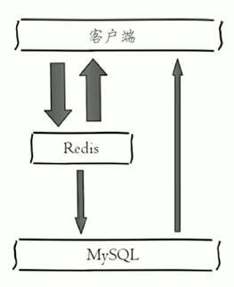
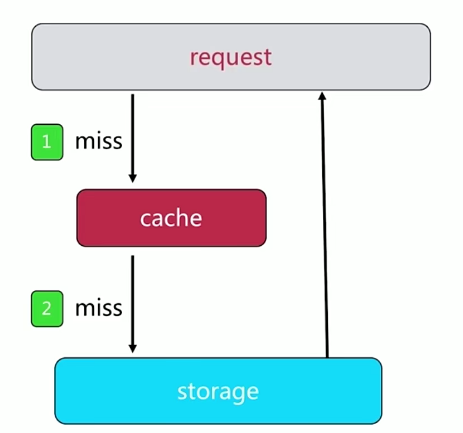
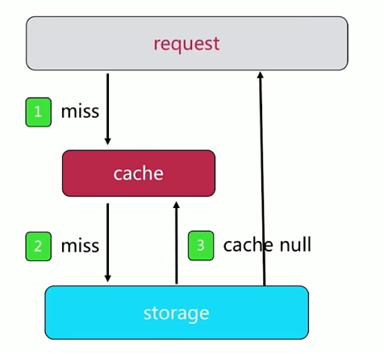
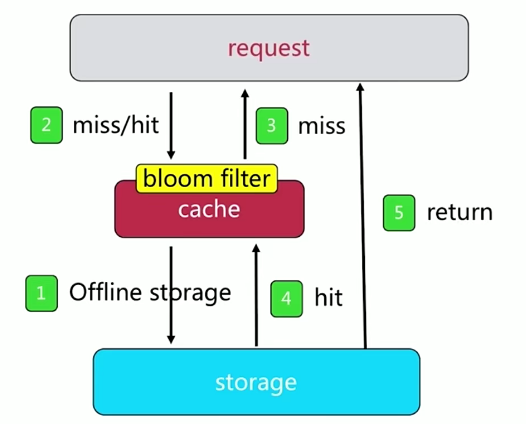
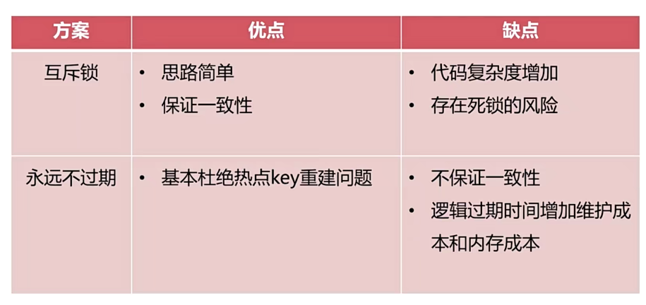

# 06 | 缓存设计与优化

## 一、缓存的收益和成本

### 1. 收益

- 加速读写：
  - 通过缓存加速读写速度：CPU L1/L2/L3 Cache、Linux page Cache加速硬盘读写、浏览器缓存、Ehcache缓存数据库结果
- 降低后端负载
  - 后端服务器通过前端缓存降低负载，业务端使用Redis降低后端MySQL负载等

### 2. 成本

- 数据不一致：缓存层和数据层有时间窗口不一致，和更新策略有关
- 代码维护成本：多了一层缓存逻辑
- 运维成本：例如Redis Cluster


### 3. 使用场景

- 降低后端负载：
  - 对高消耗的SQL：join结果集、分组统计结果 缓存
- 加速请求响应
  - 利用Redis、Memcache优化IO响应时间
- 大量写入合并为批量写
  - 如计数器先Redis累计再批量写DB


## 二、缓存更新策略

### 1. 三种更新策略

- LRU、LFU、FIFO算法剔除
  - 例如：maxmemory-policy：最大内存出现后应该怎么做

- 超时剔除
  - 例如：expire

- 主动更新
  - 开发控制生命周期


### 2. 最佳实践

- 低一致性：最大内存和淘汰策略
- 高一致性：超时剔除和主动更新结合，最大内存和淘汰策略兜底


## 三、缓存粒度控制



### 1. 典型使用场景

- 从MySQL获取用户信息：`select * from user where id={id}`

- 设置用户信息缓存：

  ```bash
  set user:{id} `select * from user where id={id}`
  ```

- 缓存粒度：

  - 全部属性
  - 部分重要属性


### 2. 缓存粒度控制：三个角度

- 通用性：全量属性更好
- 占用空间：部分属性更好
- 代码维护：表面上全量属性更好


## 四、缓存穿透优化

> 缓存穿透问题：大量请求不命中，流量直接打到数据存储层


### 1. 请求数据不存在



**原因：**

- 业务代码自身问题
- 恶意攻击、爬虫等等


**如何发现：**

- 业务的响应时间
- 相应指标：总调用数、缓存层命中数、存储层命中数


### 2. 解决策略-1：缓存空对象



- 需要更多的键(设置过期时间)
- 缓存层和数据层数据“短期”不一致


### 3. 解决策略-2：布隆过滤器



- 适用场景受限：读多写少
- 存在一定的误判


## 五、无底洞问题优化

**问题描述：**

- 2010年，Facebook有3000台Memcahe节点
- 发现问题：加机器，性能没有提升，反而下降


**问题关键点：**

- 更多的机器 != 更高的性能
- 数据增长与水平扩展需求


### 1. 优化IO的几种办法

- 命令本身优化：例如慢查询keys、hgetall bigkey
- 减少网络通信次数：m操作、pipeline
- 降低接入成本：例如客户端长连接、连接池、NIO等


### 2. 批量优化方法

- 串行mget

- 串行IO

- 并行IO

- hash_tag


## 六、缓存雪崩优化

Redis 缓存雪崩是指在缓存中大量的缓存数据在同一时间失效或者被清空，导致大量请求直接打到数据库上，引起数据库压力过大，甚至宕机的情况。为了解决和优化 Redis 缓存雪崩问题，可以采取以下一些方法：

1. **设置合理的过期时间**：避免让大量的缓存在同一时间失效，可以给缓存设置随机的过期时间，防止同时失效。
2. **使用永不过期的缓存策略**：对于一些不会变化的数据，可以考虑将其设置为永不过期，确保不会在同一时间大规模失效。
3. **多级缓存架构**：引入多级缓存，比如使用本地缓存、分布式缓存和数据库，这样即使某一级缓存发生雪崩，其他级缓存也能够缓解数据库的压力。
4. **缓存预热**：系统启动时或者缓存过期前，提前加载热点数据到缓存中，避免在高并发时才去加载数据导致雪崩。
5. **限流和熔断**：在缓存雪崩发生时，可以通过限制请求量或者暂时关闭一些非必要的服务来减轻数据库的压力。
6. **分布式锁**：在缓存失效时，可以使用分布式锁来避免大量请求同时查询数据库，确保只有一个请求去查询数据库并重新加载缓存。
7. **异步加载缓存**：将缓存的加载放在异步任务中进行，避免在请求处理过程中去加载缓存，提高系统的响应速度。


## 七、热点key重建优化

### 1. 问题描述：热点Key + 较长的重建时间


在高并发场景下，在热点Key失效后，大量的请求都会做缓存重建


### 2. 解决办法

三个目标：

- 减少重建缓存的次数
- 数据尽可能一致
- 减少潜在风险


两个解决：

- 互斥锁


- 永不过期
  - 缓存层：没有设置过期时间(没有用expire)
  - 功能层：为每个value添加逻辑过期时间，发现超过逻辑过期时间后，会使用单独的线程去构建缓存


### 3. 两种方式对比




## 八、总结

- 缓存收益：加速读写、降低后端负载
- 缓存成本：缓存和存储数据不一致、代码维护成本、运维成本
- 穿透问题：使用缓存空对象和布隆过滤器来解决，注意它们各自的使用场景和局限性
- 缓存无底洞问题：分布式缓存中，有更多的机器不保证有更高的性能。有四种批量操作方式：串行命令、串行IO、并行IO、hash_tag
- 雪崩问题：缓存层高可用、客户端降级、提前演练是解决雪崩问题的重要方法
- 热点key问题：互斥锁、“永不过期”能够在一定程度上解决热点key问题